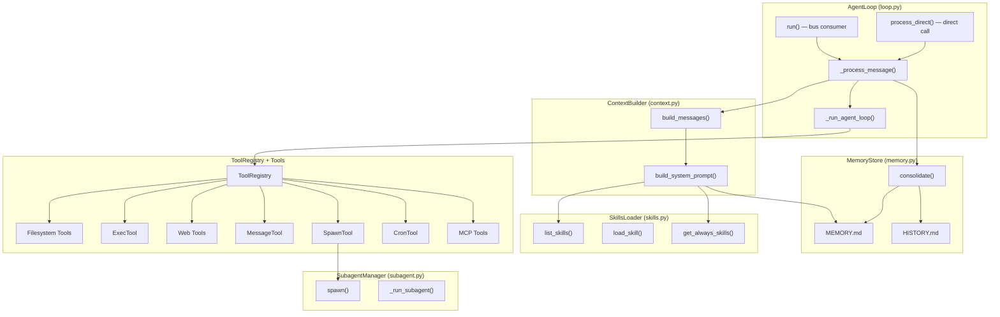

# Agent Module Architecture

This directory contains analysis documents for the `nanobot/agent/` module — the core processing engine of nanobot.

## Module Map

```
nanobot/agent/
├── loop.py          # AgentLoop — the main processing engine
├── context.py       # ContextBuilder — system prompt assembly
├── memory.py        # MemoryStore — two-layer persistent memory
├── skills.py        # SkillsLoader — skill discovery and loading
├── subagent.py      # SubagentManager — background task execution
└── tools/
    ├── base.py      # Tool ABC — abstract base for all tools
    ├── registry.py  # ToolRegistry — dynamic tool management
    ├── shell.py     # ExecTool — shell command execution
    ├── filesystem.py# ReadFile, WriteFile, EditFile, ListDir
    ├── web.py       # WebSearch, WebFetch
    ├── message.py   # MessageTool — send to chat channels
    ├── spawn.py     # SpawnTool — create background subagents
    ├── cron.py      # CronTool — schedule reminders/tasks
    └── mcp.py       # MCP client — Model Context Protocol integration
```

## High-Level Architecture



## Data Flow Summary

```mermaid
sequenceDiagram
    participant Ext as External (Bus / CLI)
    participant Loop as AgentLoop
    participant Ctx as ContextBuilder
    participant LLM as LLM Provider
    participant Tools as ToolRegistry

    Ext->>Loop: InboundMessage
    Loop->>Ctx: build_messages(history, message)
    Ctx-->>Loop: [system, ...history, runtime_ctx, user_msg]
    Loop->>LLM: chat(messages, tools)
    LLM-->>Loop: response

    loop Tool iterations (up to 40)
        Loop->>Tools: execute(tool_name, args)
        Tools-->>Loop: result string
        Loop->>LLM: chat(messages + tool_result)
        LLM-->>Loop: response
    end

    Loop-->>Ext: OutboundMessage (final response)
```

## Documents

| File | Covers |
|------|--------|
| [loop.md](loop.md) | `AgentLoop` — core processing engine |
| [context.md](context.md) | `ContextBuilder` — system prompt assembly |
| [memory.md](memory.md) | `MemoryStore` — two-layer persistent memory |
| [skills.md](skills.md) | `SkillsLoader` — skill discovery and loading |
| [subagent.md](subagent.md) | `SubagentManager` — background task execution |
| [tools/README.md](tools/README.md) | Tool system overview |
| [tools/registry.md](tools/registry.md) | `ToolRegistry` — dynamic tool management |
| [tools/filesystem.md](tools/filesystem.md) | Filesystem tools (read, write, edit, list_dir) |
| [tools/shell.md](tools/shell.md) | `ExecTool` — shell command execution |
| [tools/web.md](tools/web.md) | `WebSearchTool` + `WebFetchTool` |
| [tools/message.md](tools/message.md) | `MessageTool` — channel message delivery |
| [tools/spawn.md](tools/spawn.md) | `SpawnTool` — background subagent creation |
| [tools/cron.md](tools/cron.md) | `CronTool` — scheduling interface |
| [tools/mcp.md](tools/mcp.md) | MCP integration — Model Context Protocol |
