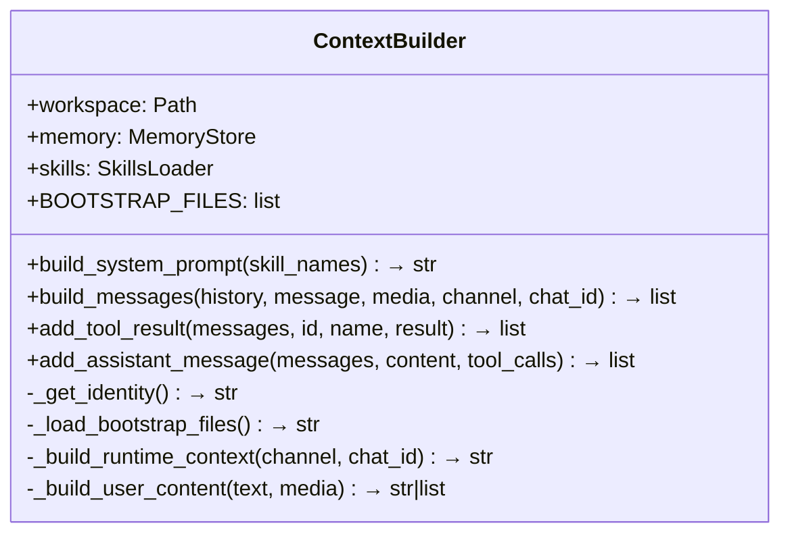
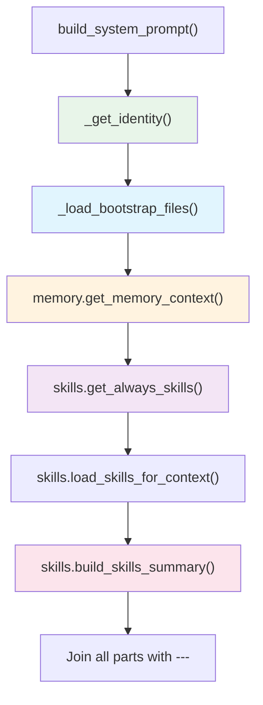
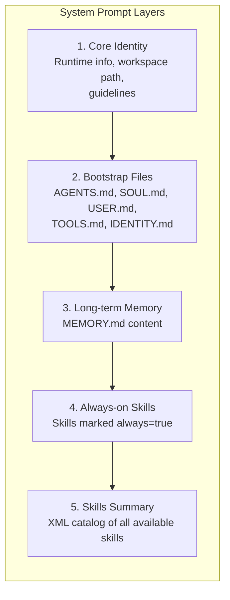
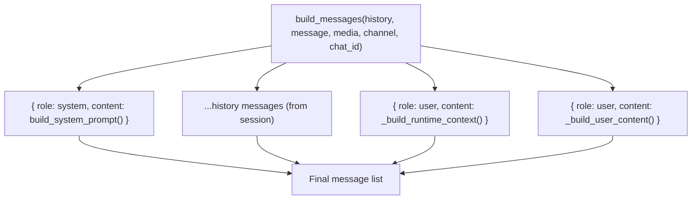
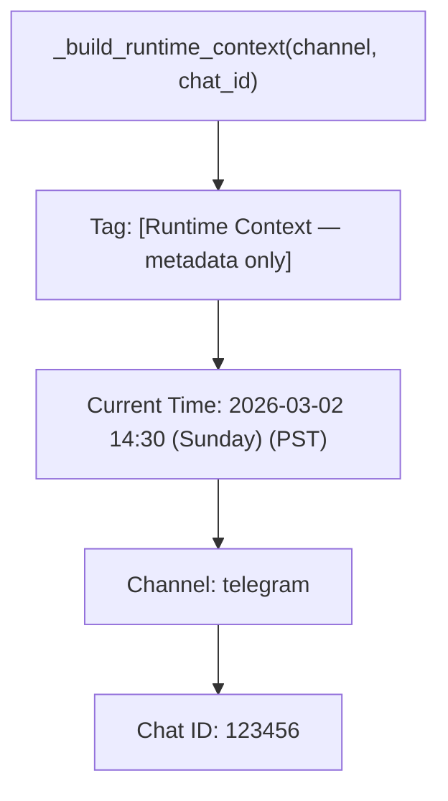
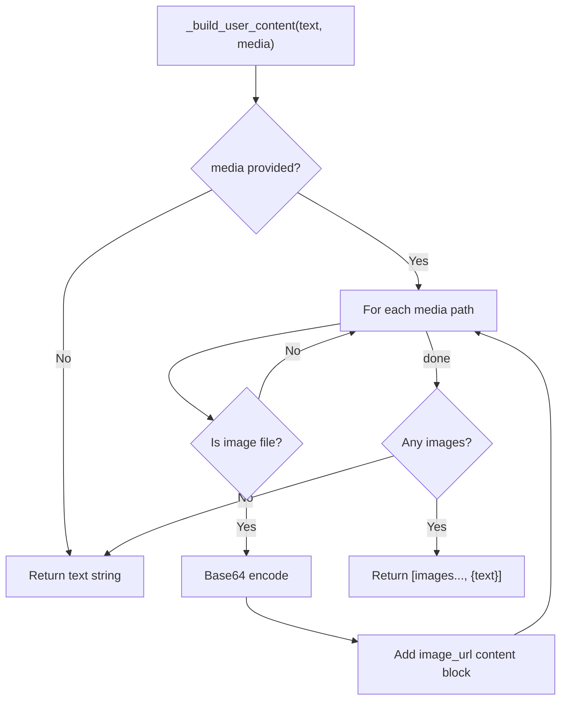
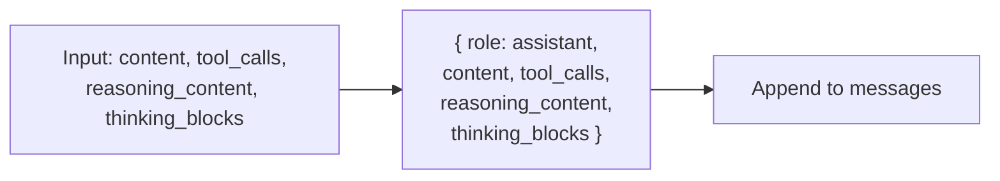
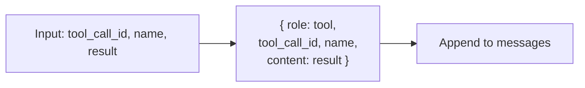

# ContextBuilder — System Prompt Assembly

**Source:** `nanobot/agent/context.py`

## Purpose

Assembles the complete LLM message list from layers: identity, bootstrap files, memory, skills, runtime metadata, and the user's message. This is the "brain builder" that determines what the agent knows and can do.

## Class Overview



## System Prompt Assembly



### Layer Details



| Layer | Source | When Included |
|-------|--------|---------------|
| Core Identity | Hardcoded in `_get_identity()` | Always |
| Bootstrap Files | `workspace/{AGENTS,SOUL,USER,TOOLS,IDENTITY}.md` | If file exists |
| Memory | `workspace/memory/MEMORY.md` | If non-empty |
| Always-on Skills | Skills with `always: true` in frontmatter | If any exist and requirements met |
| Skills Summary | All skills (XML catalog) | If any skills exist |

### Identity Section Content

The identity section includes:
- Agent name and persona ("nanobot")
- Runtime info: OS, architecture, Python version
- Workspace path and key file locations
- Behavioral guidelines (state intent, read before modify, etc.)

---

## Full Message List Construction



### Message list structure:

```
[
  { role: "system",    content: "<assembled system prompt>" },
  ...history[],        // unconsolidated session messages
  { role: "user",      content: "[Runtime Context] time, channel, chat_id" },
  { role: "user",      content: "<user message or multimodal content>" },
]
```

### Runtime Context Block



This is injected as a separate user message just before the actual user input. The tag `_RUNTIME_CONTEXT_TAG` is used by `_save_turn()` to filter it out of session persistence.

---

## Media Handling



When media is attached, the user content becomes a multimodal array:
```json
[
  { "type": "image_url", "image_url": { "url": "data:image/png;base64,..." } },
  { "type": "text", "text": "user message" }
]
```

---

## Message Mutation Helpers

These methods are used by `_run_agent_loop()` to incrementally build the conversation:

### `add_assistant_message()`



Supports extended thinking (`reasoning_content` for DeepSeek, `thinking_blocks` for Claude).

### `add_tool_result()`


