# AgentLoop — Core Processing Engine

**Source:** `nanobot/agent/loop.py`

## Purpose

The `AgentLoop` is the central brain of nanobot. It receives messages, builds LLM context, calls the model, executes tool calls in a loop, and returns responses. It operates in two modes: bus-driven (gateway) and direct-call (CLI/cron).

## Class Overview

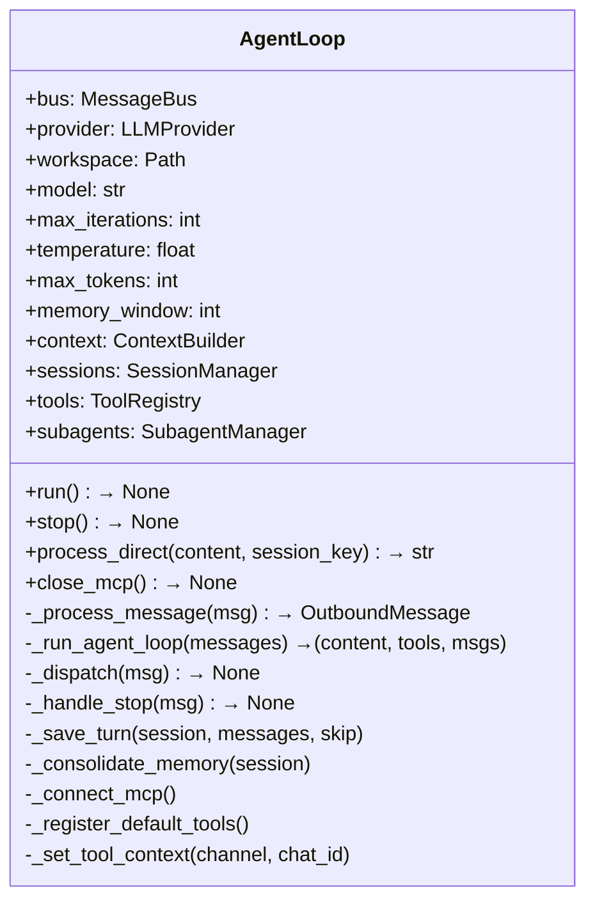

## Two Entry Points

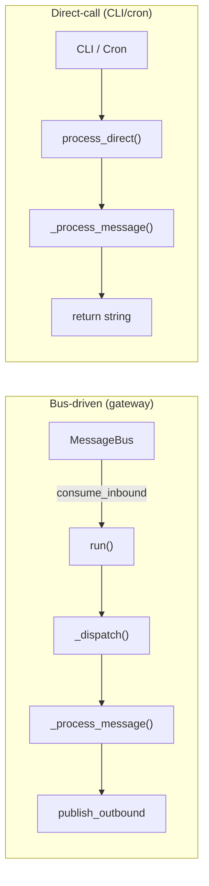

### `run()` — Bus Consumer (lines 259-276)

Long-running loop for gateway mode. Consumes `InboundMessage` from the bus and dispatches each as an asyncio task.

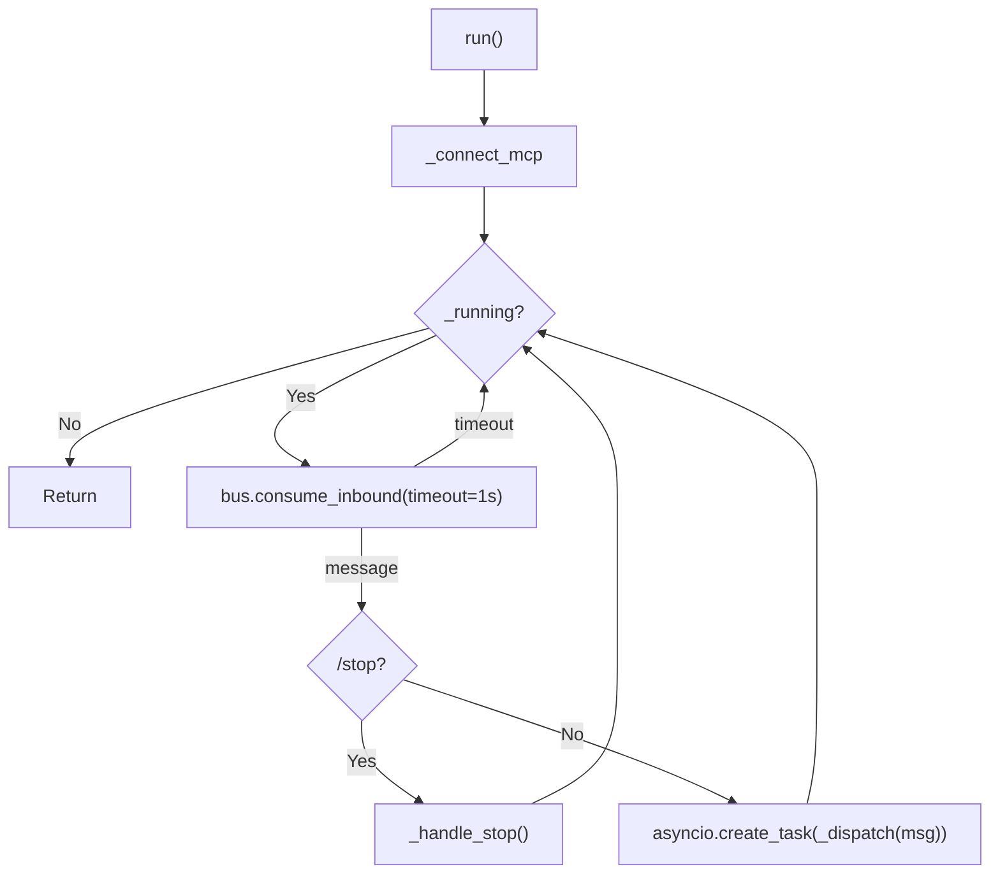

Key design: each message is dispatched as an independent asyncio task, tracked in `_active_tasks[session_key]`, so `/stop` can cancel in-flight work.

### `process_direct()` — Direct Call (lines 486-498)

Synchronous-style entry for CLI and cron. Bypasses the bus entirely.

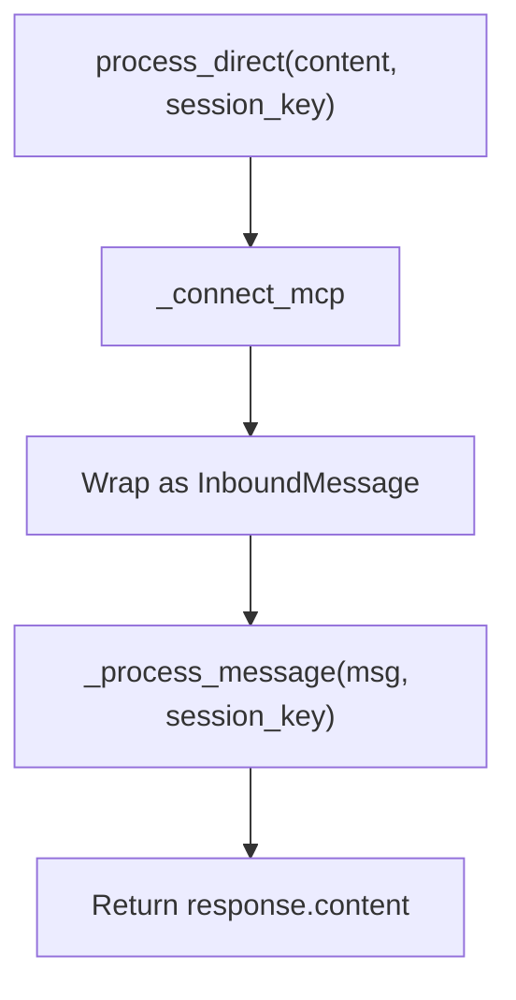

---

## Core Processing Pipeline

### `_process_message()` (lines 330-453)

The heart of the agent. Handles all message types, slash commands, memory consolidation, context building, and the LLM iteration loop.

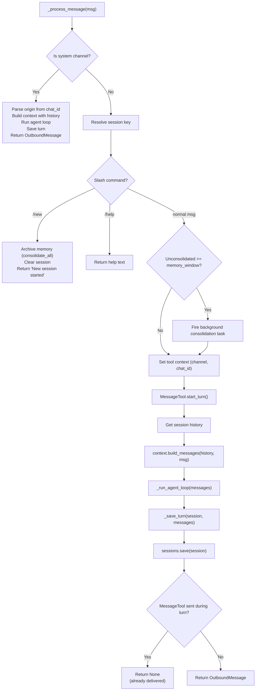

### `_run_agent_loop()` (lines 180-257)

The LLM iteration cycle. Calls the model, executes any tool calls, and loops until the model returns a final text response or hits `max_iterations`.

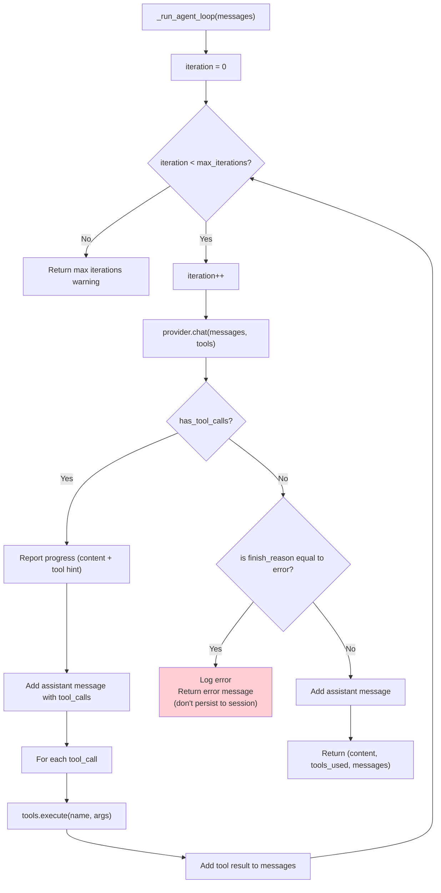

---

## Session Lifecycle

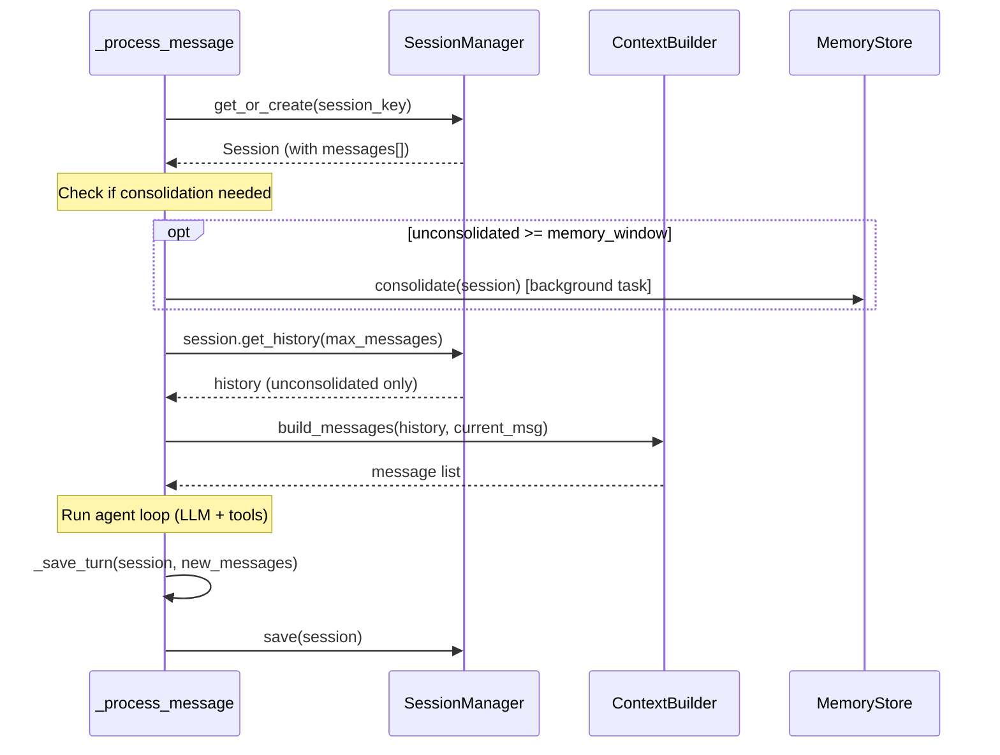

## `/stop` Handler

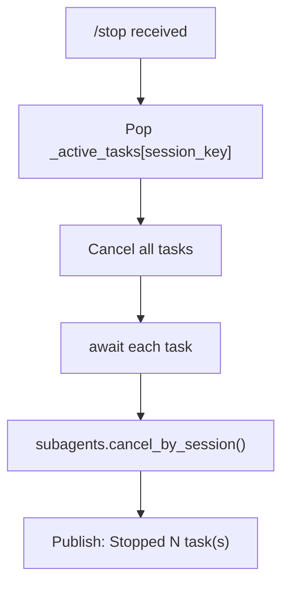

## `/new` Handler

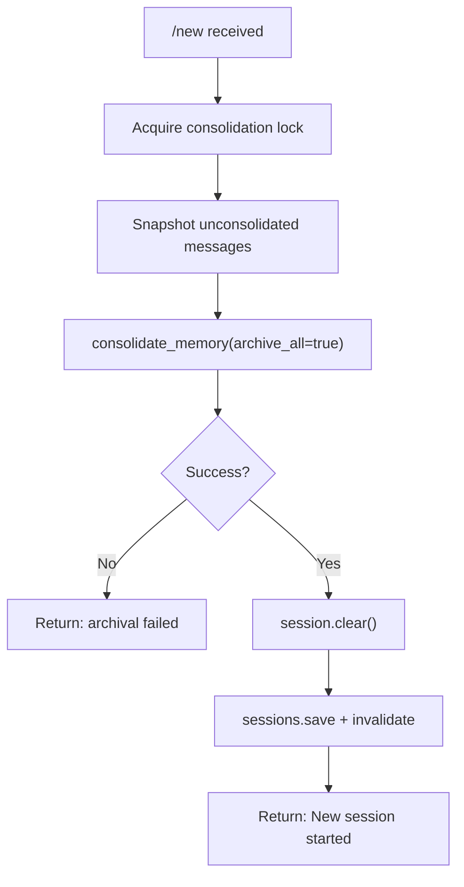

## Concurrency Model

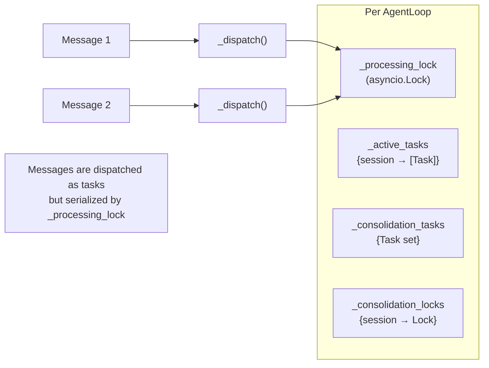

- **`_processing_lock`**: Global lock ensuring one message is processed at a time (prevents race conditions on session state).
- **`_active_tasks`**: Per-session task tracking, enabling `/stop` to cancel in-flight work.
- **`_consolidation_locks`**: Per-session locks preventing concurrent consolidation of the same session.
- **`_consolidation_tasks`**: Strong references to keep consolidation tasks alive.

## `_save_turn()` Details (lines 455-477)

Persists new messages to the session, with these transformations:

| Condition | Action |
|-----------|--------|
| Empty assistant message (no content, no tool_calls) | Skip — prevents poisoned context |
| Tool result > 500 chars | Truncate with `... (truncated)` |
| User message starting with runtime context tag | Skip — metadata only |
| Image content (base64 data URI) | Replace with `[image]` placeholder |
| All messages | Add `timestamp` if missing |

## Tool Registration

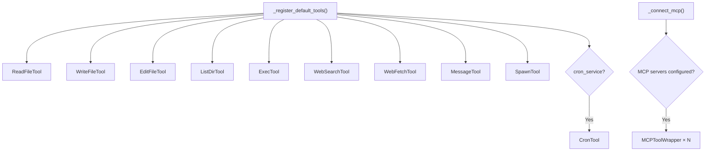

## MCP Connection (Lazy, One-Time)

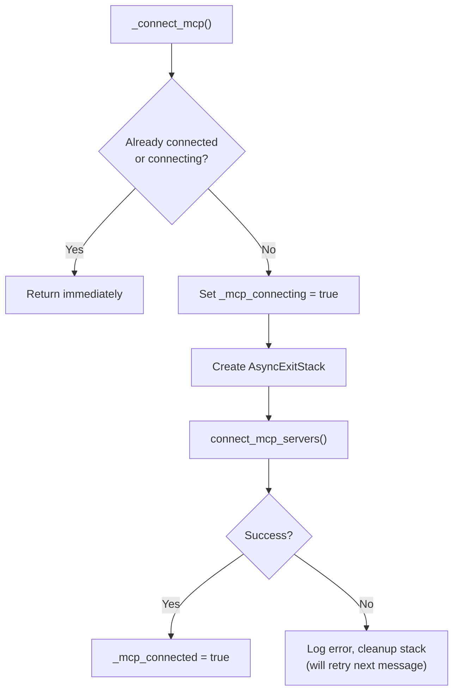
