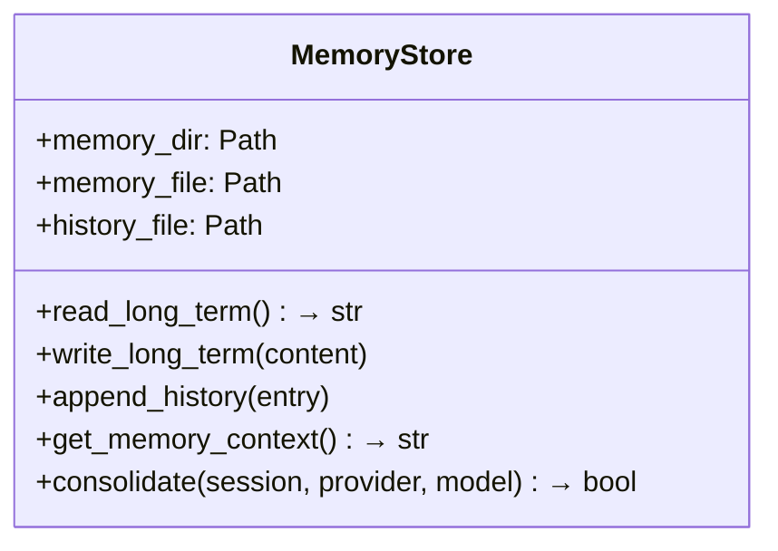
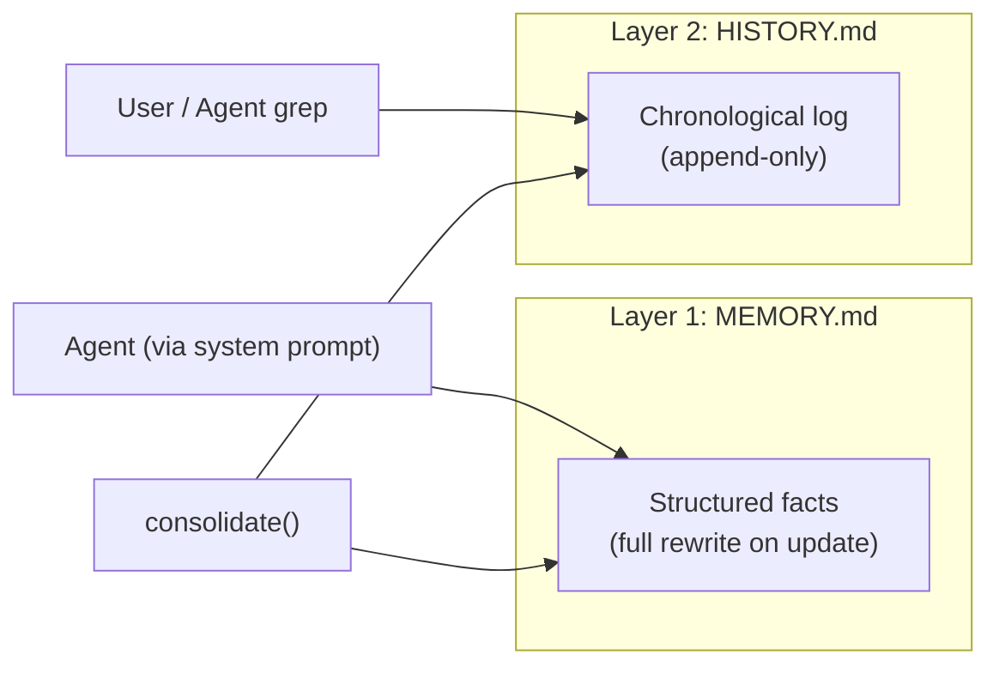
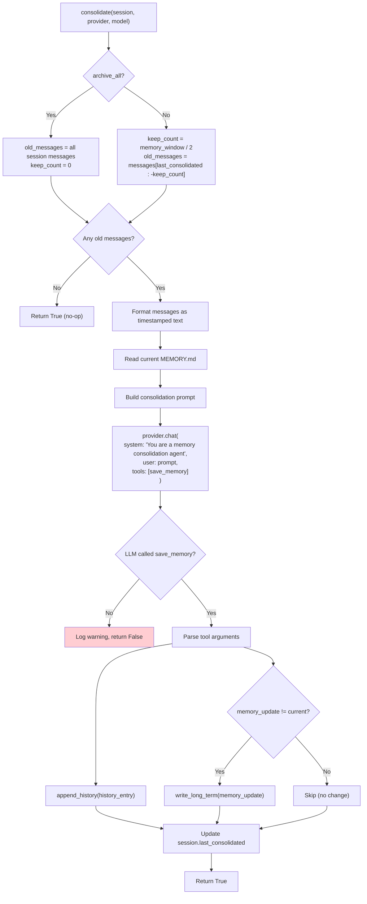
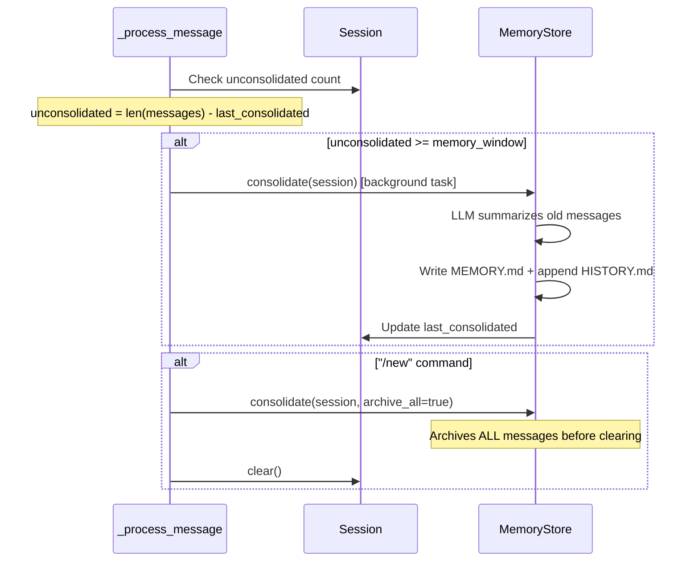
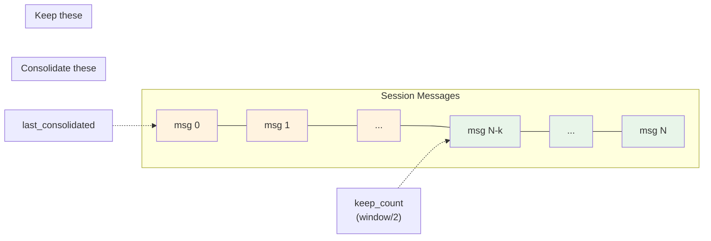
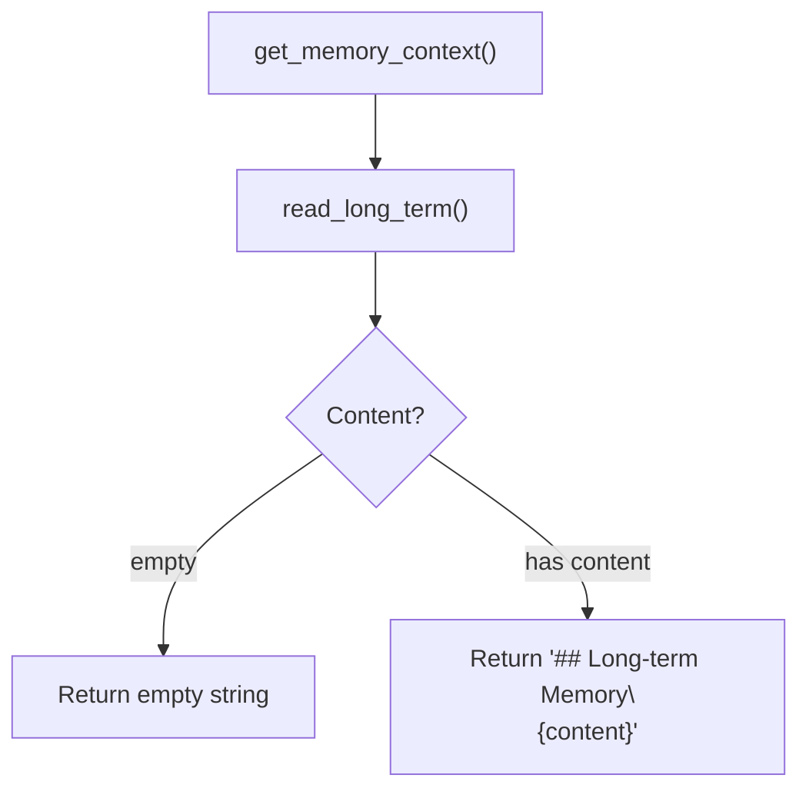

# MemoryStore — Two-Layer Persistent Memory

**Source:** `nanobot/agent/memory.py`

## Purpose

Implements nanobot's persistent memory system with two complementary layers:
- **MEMORY.md** — structured long-term facts (updated by LLM consolidation)
- **HISTORY.md** — append-only, grep-searchable event log

## Class Overview



## File Layout

```
workspace/memory/
├── MEMORY.md     # Long-term facts (rewritten on consolidation)
└── HISTORY.md    # Event log (append-only, timestamped)
```

## Two-Layer Design



| Property | MEMORY.md | HISTORY.md |
|----------|-----------|------------|
| Format | Markdown (any structure) | `[YYYY-MM-DD HH:MM]` entries |
| Update mode | Full rewrite | Append-only |
| Purpose | Facts the agent always sees | Searchable log of past events |
| Included in prompt | Yes (via `get_memory_context()`) | No (too large; grep instead) |
| Updated by | LLM `save_memory` tool call | LLM `save_memory` tool call |

---

## Consolidation Flow

Consolidation is triggered when unconsolidated messages exceed `memory_window`. The LLM summarizes old conversation into both memory layers.



### `save_memory` Virtual Tool

The consolidation LLM is given a single tool to structure its output:

```json
{
  "name": "save_memory",
  "parameters": {
    "history_entry": "Timestamped paragraph (2-5 sentences) for HISTORY.md",
    "memory_update": "Full updated MEMORY.md content"
  }
}
```

This forces the LLM to produce structured output rather than free text.

---

## Consolidation Trigger Points



### Consolidation Boundary Calculation



- **Normal consolidation**: Processes `messages[last_consolidated : -keep_count]`, keeps the most recent `keep_count` messages.
- **Archive all** (`/new`): Processes all messages, sets `last_consolidated = 0`.

## Read Path (used by ContextBuilder)



This is included in the system prompt on every LLM call, giving the agent persistent knowledge across sessions.
