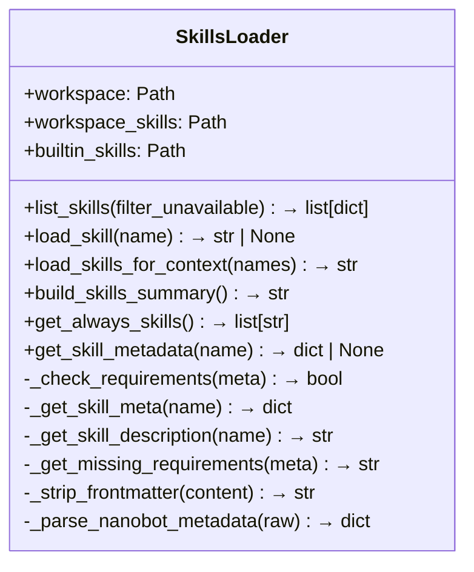
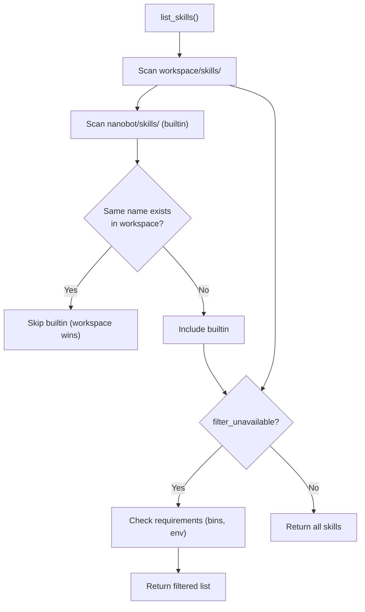
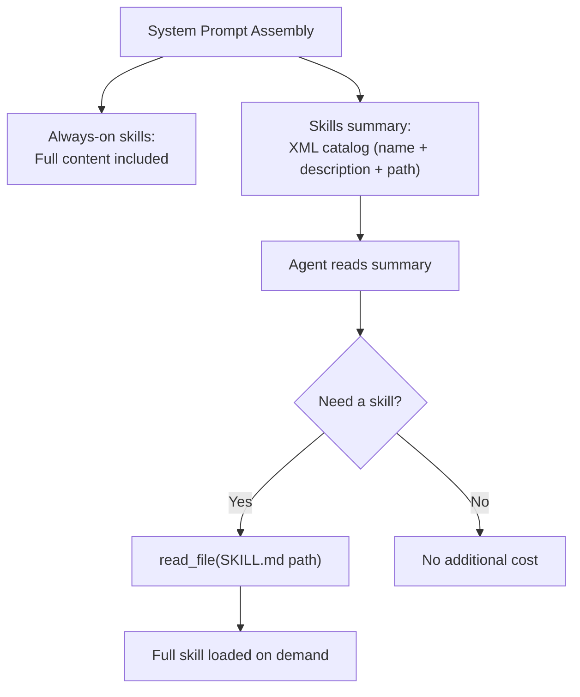
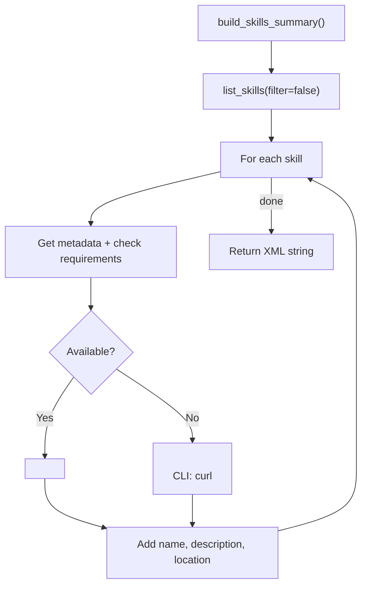
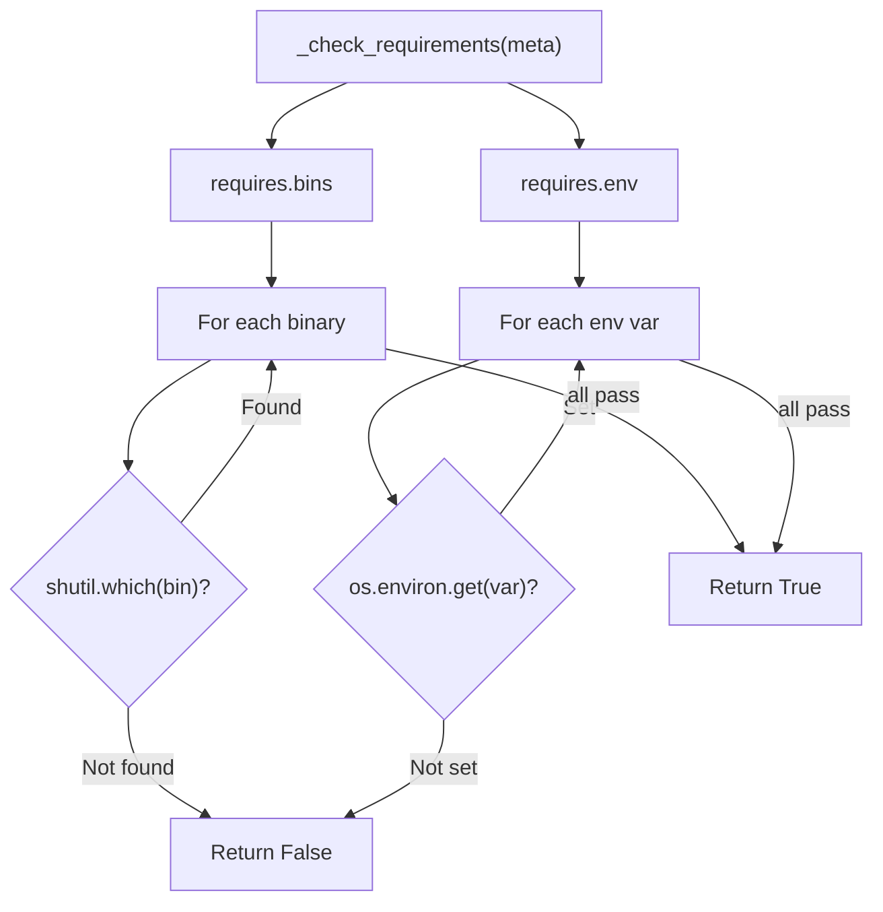
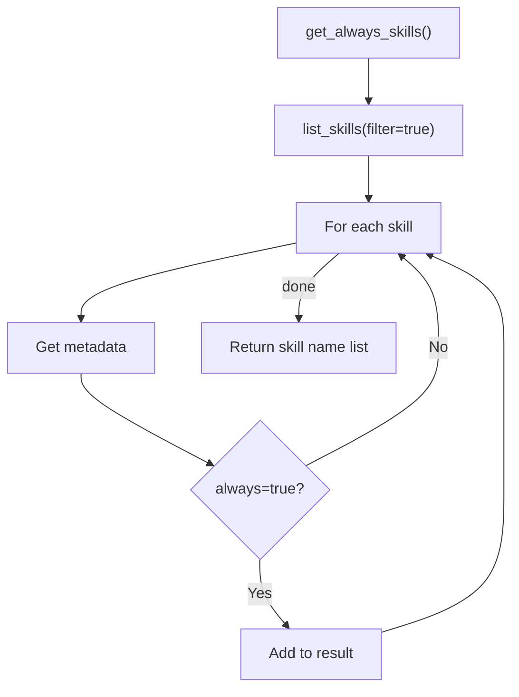

# SkillsLoader — Skill Discovery and Loading

**Source:** `nanobot/agent/skills.py`

## Purpose

Discovers, loads, and manages agent skills — markdown files (`SKILL.md`) that teach the agent how to use specific tools or perform certain tasks. Skills are loaded from two sources with workspace taking priority.

## Class Overview



## Skill Sources (Priority Order)



| Source | Path | Priority |
|--------|------|----------|
| Workspace | `~/.nanobot/workspace/skills/{name}/SKILL.md` | Highest (overrides builtin) |
| Builtin | `nanobot/skills/{name}/SKILL.md` | Lower (fallback) |

## Skill File Structure

```
skills/
├── weather/
│   └── SKILL.md       # Frontmatter + instructions
├── github/
│   └── SKILL.md
├── tmux/
│   └── SKILL.md
└── ...
```

### SKILL.md Frontmatter

```yaml
---
description: "Weather lookups using wttr.in"
always: false
metadata: '{"nanobot": {"requires": {"bins": ["curl"]}, "always": false}}'
---

# Weather Skill

Instructions for the agent on how to use this skill...
```

## Progressive Loading Strategy



This two-tier approach keeps the system prompt lean:
1. **Always-on skills** (e.g., critical skills marked `always: true`) are injected into every prompt.
2. **Other skills** appear only as a lightweight XML summary. The agent loads full content via `read_file` when needed.

## Skills Summary Format



Output example:
```xml
<skills>
  <skill available="true">
    <name>weather</name>
    <description>Weather lookups using wttr.in</description>
    <location>/home/user/.nanobot/workspace/skills/weather/SKILL.md</location>
  </skill>
  <skill available="false">
    <name>tmux</name>
    <description>Terminal multiplexer management</description>
    <location>/home/user/.nanobot/workspace/skills/tmux/SKILL.md</location>
    <requires>CLI: tmux</requires>
  </skill>
</skills>
```

## Requirement Checking



Requirements support two types:
- **`bins`**: CLI executables that must be in PATH (checked via `shutil.which`)
- **`env`**: Environment variables that must be set

## Always-On Skills



Skills marked `always: true` in their frontmatter metadata are loaded into every system prompt. Use sparingly — each always-on skill adds to every LLM call's token count.
