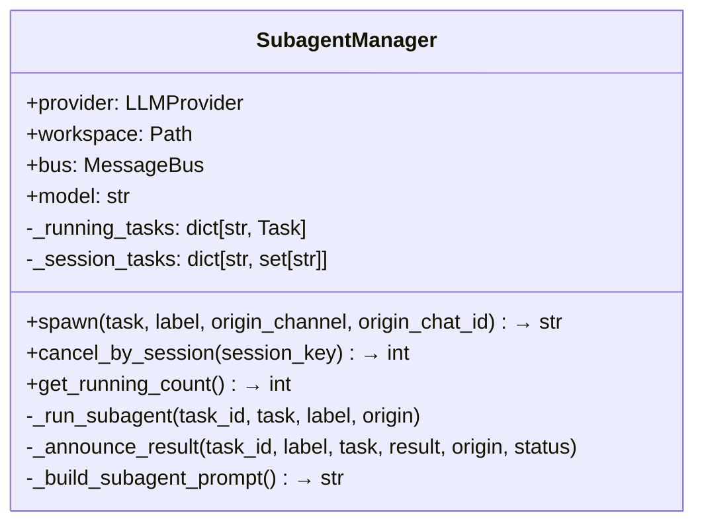
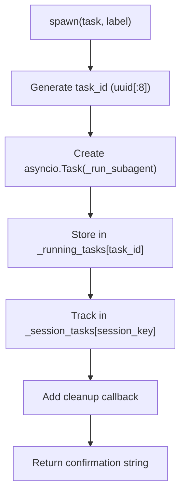
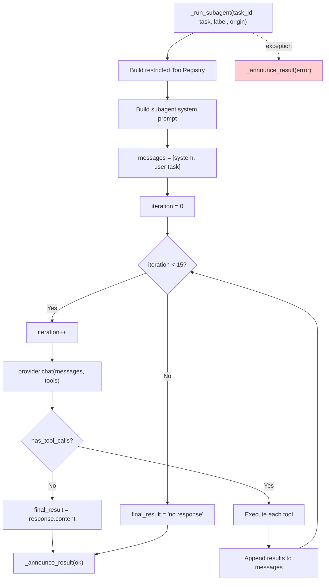
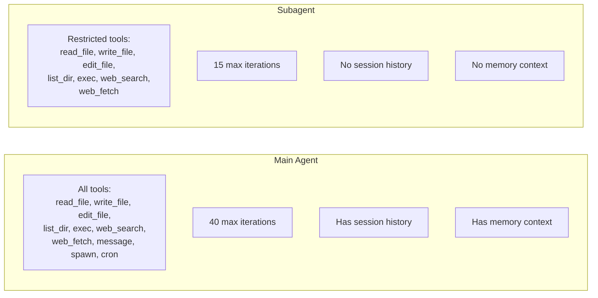
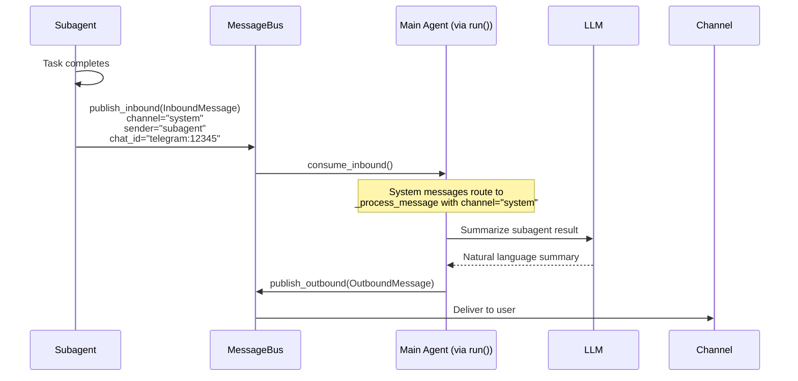
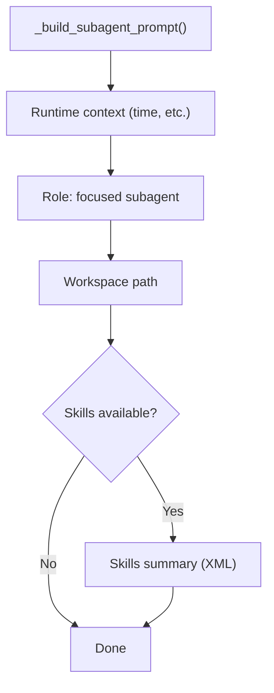
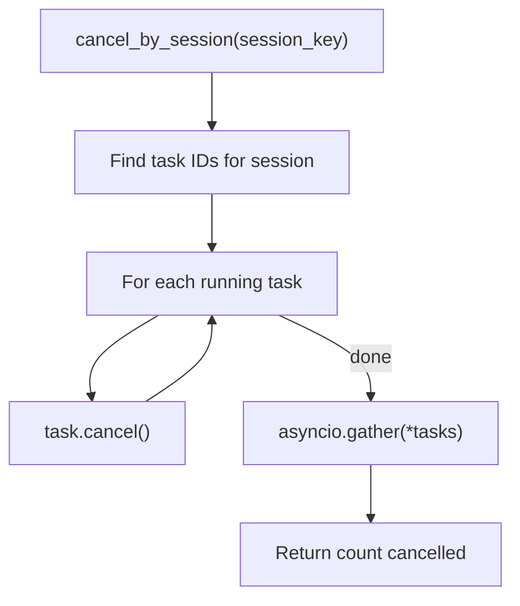
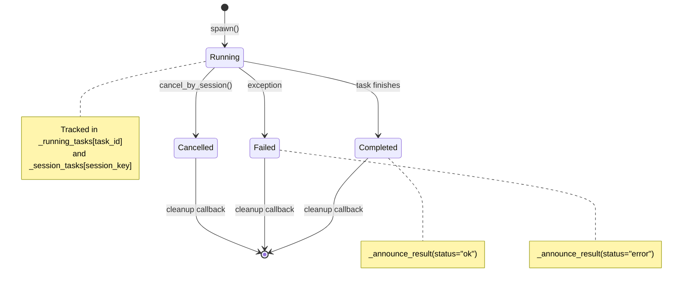

# SubagentManager — Background Task Execution

**Source:** `nanobot/agent/subagent.py`

## Purpose

Manages background subagents — lightweight, independent agent instances that execute tasks concurrently without blocking the main conversation. Each subagent gets its own tool set (no message/spawn/cron) and runs up to 15 tool iterations.

## Class Overview



## Spawn Flow



## Subagent Execution



## Subagent vs Main Agent



Key restrictions for subagents:
- **No `message` tool** — cannot send messages directly to users
- **No `spawn` tool** — cannot spawn sub-subagents (prevents recursion)
- **No `cron` tool** — cannot schedule tasks
- **No session/memory** — starts with a clean slate each time
- **15 iterations** (vs 40 for main agent) — bounded execution

## Result Announcement

When a subagent completes, it announces back to the main agent via the message bus:



### Announcement Content Format

```
[Subagent 'weather lookup' completed successfully]

Task: Check the weather in Vancouver

Result:
Currently 12°C and partly cloudy in Vancouver...

Summarize this naturally for the user. Keep it brief (1-2 sentences).
Do not mention technical details like "subagent" or task IDs.
```

The main agent processes this as a "system" channel message and produces a clean summary for the user.

## Subagent System Prompt



The subagent prompt is intentionally minimal:
- Runtime metadata (time)
- Role instruction ("you are a subagent, stay focused")
- Workspace path
- Skills summary (can `read_file` to load full skill)

No identity files, no memory, no conversation history.

## Cancellation



Cancellation is triggered by the `/stop` command in `AgentLoop._handle_stop()`.

## Task Lifecycle


