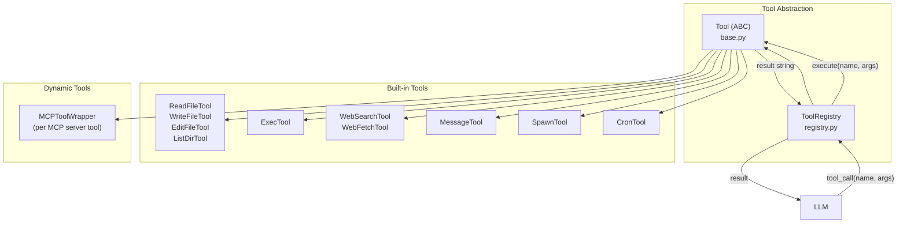
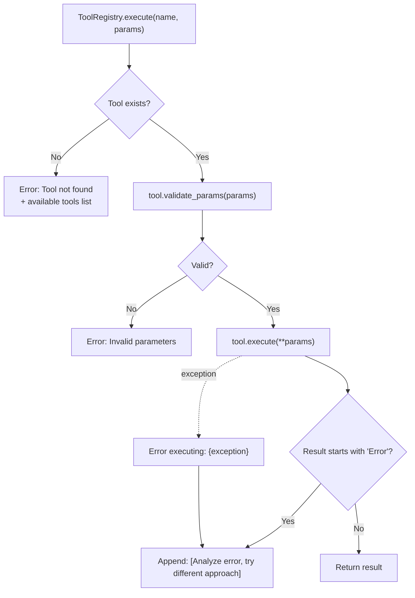

# Tool System Overview

**Source:** `nanobot/agent/tools/`

## Purpose

The tool system gives the agent the ability to interact with the environment — execute shell commands, read/write files, search the web, send messages, schedule tasks, and connect to external services via MCP.

## Architecture



## Tool Registration

```mermaid
sequenceDiagram
    participant Loop as AgentLoop.__init__
    participant Reg as ToolRegistry
    participant MCP as connect_mcp_servers

    Loop->>Reg: register(ReadFileTool)
    Loop->>Reg: register(WriteFileTool)
    Loop->>Reg: register(EditFileTool)
    Loop->>Reg: register(ListDirTool)
    Loop->>Reg: register(ExecTool)
    Loop->>Reg: register(WebSearchTool)
    Loop->>Reg: register(WebFetchTool)
    Loop->>Reg: register(MessageTool)
    Loop->>Reg: register(SpawnTool)
    opt cron_service provided
        Loop->>Reg: register(CronTool)
    end
    opt MCP servers configured
        MCP->>Reg: register(MCPToolWrapper) × N
    end
```

## Tool Inventory

| Tool | Name | Source | Capabilities |
|------|------|--------|-------------|
| [ReadFileTool](filesystem.md) | `read_file` | filesystem.py | Read file contents |
| [WriteFileTool](filesystem.md) | `write_file` | filesystem.py | Create/overwrite files |
| [EditFileTool](filesystem.md) | `edit_file` | filesystem.py | Find-and-replace in files |
| [ListDirTool](filesystem.md) | `list_dir` | filesystem.py | List directory contents |
| [ExecTool](shell.md) | `exec` | shell.py | Execute shell commands |
| [WebSearchTool](web.md) | `web_search` | web.py | Brave Search API |
| [WebFetchTool](web.md) | `web_fetch` | web.py | Fetch and extract web content |
| [MessageTool](message.md) | `message` | message.py | Send to chat channels |
| [SpawnTool](spawn.md) | `spawn` | spawn.py | Create background subagents |
| [CronTool](cron.md) | `cron` | cron.py | Schedule reminders/tasks |
| [MCPToolWrapper](mcp.md) | `mcp_{server}_{tool}` | mcp.py | External MCP server tools |

## Execution Flow



The error hint `[Analyze the error above and try a different approach.]` is automatically appended to all error results, nudging the LLM to self-correct.

## Documents

| File | Covers |
|------|--------|
| [registry.md](registry.md) | `ToolRegistry` — dynamic tool management |
| [filesystem.md](filesystem.md) | File system tools (read, write, edit, list_dir) |
| [shell.md](shell.md) | `ExecTool` — shell command execution |
| [web.md](web.md) | `WebSearchTool` + `WebFetchTool` |
| [message.md](message.md) | `MessageTool` — channel message delivery |
| [spawn.md](spawn.md) | `SpawnTool` — background subagent creation |
| [cron.md](cron.md) | `CronTool` — scheduling interface |
| [mcp.md](mcp.md) | MCP integration — Model Context Protocol |
