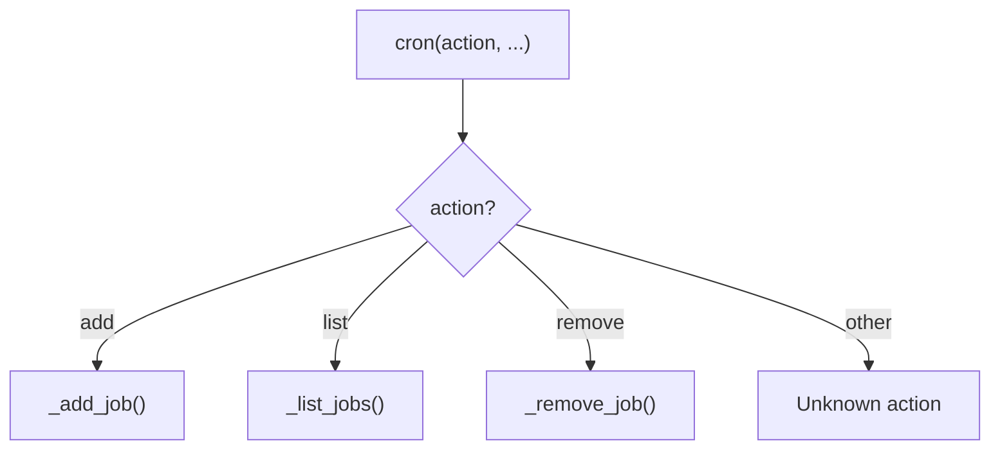
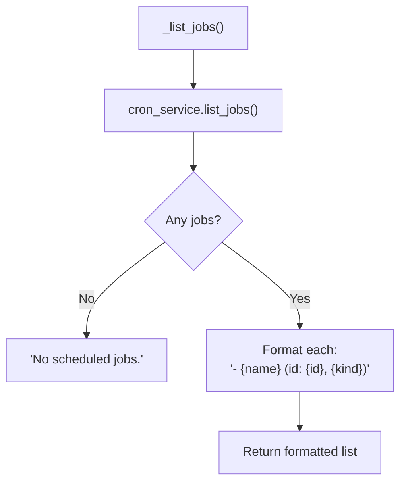
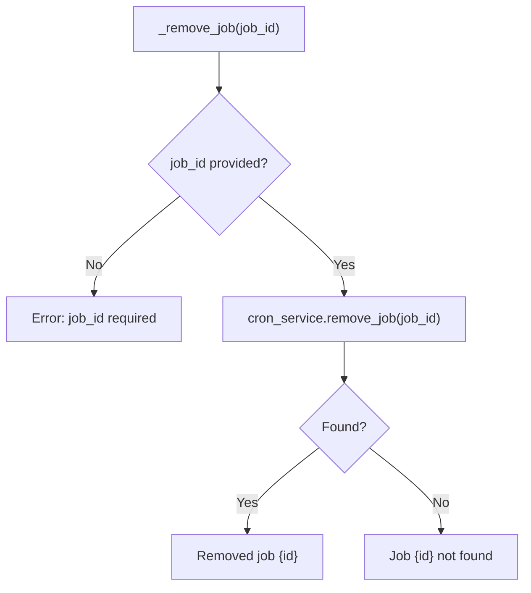
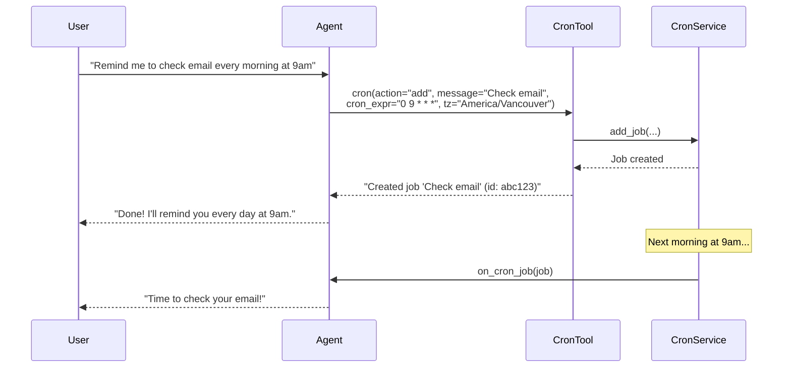

# CronTool — Scheduling Interface

**Source:** `nanobot/agent/tools/cron.py`

## Purpose

Allows the agent to manage scheduled jobs through natural language — creating reminders, listing scheduled tasks, and removing them. Delegates to `CronService` for persistence and execution.

## Parameters

| Parameter | Type | Required | Description |
|-----------|------|----------|-------------|
| `action` | string | Yes | `"add"`, `"list"`, or `"remove"` |
| `message` | string | For add | Reminder/task instruction |
| `every_seconds` | integer | - | Recurring interval |
| `cron_expr` | string | - | Cron expression (e.g. `0 9 * * *`) |
| `tz` | string | - | IANA timezone (cron only) |
| `at` | string | - | ISO datetime for one-shot |
| `job_id` | string | For remove | Job ID to remove |

## Action Dispatch



---

## Add Job

```mermaid
flowchart TD
    A["_add_job(message, every_seconds, cron_expr, tz, at)"] --> B{message provided?}
    B -- No --> ERR1["Error: message required"]

    B -- Yes --> C{channel + chat_id set?}
    C -- No --> ERR2["Error: no session context"]

    C -- Yes --> D{tz without cron_expr?}
    D -- Yes --> ERR3["Error: tz only with cron"]

    D -- No --> E{tz provided?}
    E -- Yes --> F["Validate ZoneInfo(tz)"]
    F --> G{Valid?}
    G -- No --> ERR4["Error: unknown timezone"]

    E -- No & G -- Yes --> H{Schedule type?}
    H -- every_seconds --> I["CronSchedule(kind='every')"]
    H -- cron_expr --> J["CronSchedule(kind='cron')"]
    H -- at --> K["CronSchedule(kind='at')<br/>delete_after=true"]
    H -- none --> ERR5["Error: schedule required"]

    I & J & K --> L["cron_service.add_job(...)"]
    L --> M["Return: Created job '{name}' (id: {id})"]
```

### Schedule Types

| Type | Parameter | Behavior |
|------|-----------|----------|
| Recurring | `every_seconds` | Runs every N seconds |
| Cron | `cron_expr` (+`tz`) | Runs on cron schedule |
| One-shot | `at` | Runs once, then deleted |

### Delivery Configuration

Jobs created by the agent are always set with `deliver=True`, targeting the current `channel:chat_id`. This means when the job fires, the response will be sent back to the user who requested it.

---

## List Jobs



---

## Remove Job



---

## Typical Conversation


