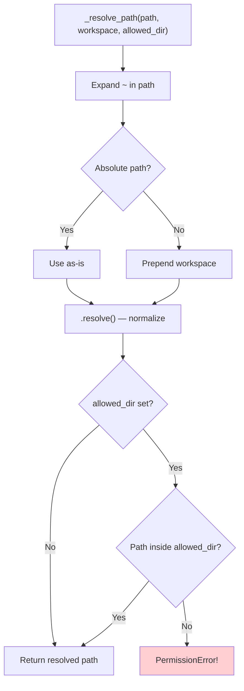
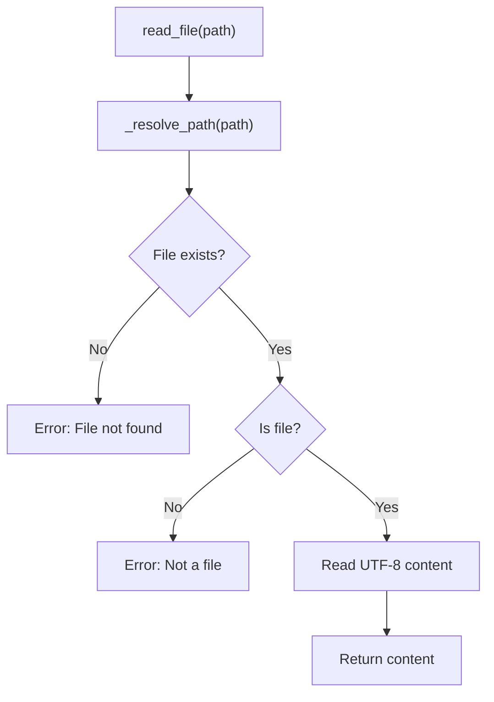
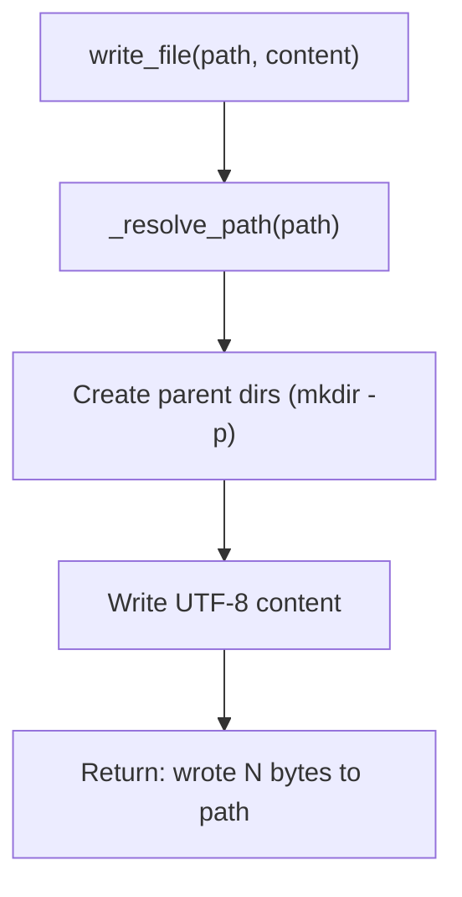
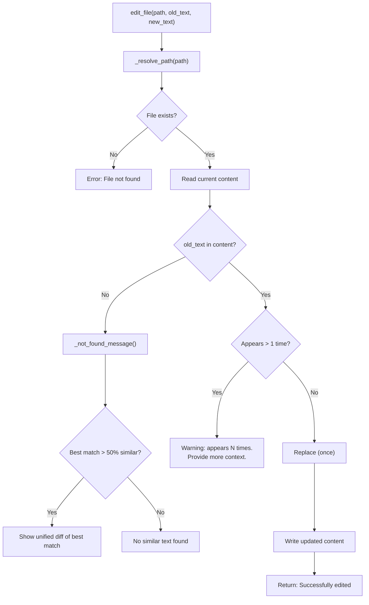
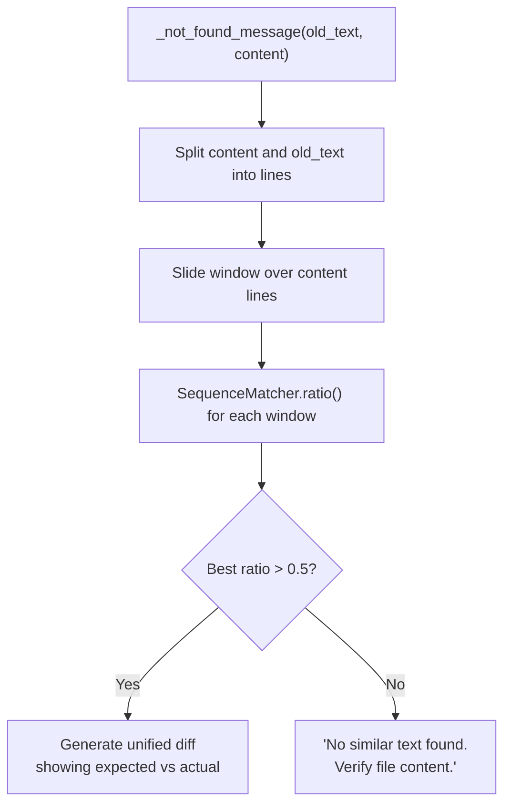
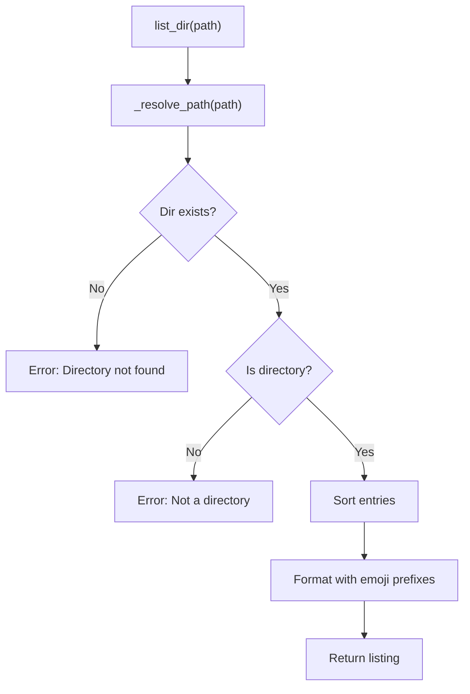

# Filesystem Tools — ReadFile, WriteFile, EditFile, ListDir

**Source:** `nanobot/agent/tools/filesystem.py`

## Purpose

Four tools for file system operations: reading, writing, editing (find-and-replace), and directory listing. All support workspace-relative path resolution and optional directory restriction.

## Tools Summary

| Tool | Name | Parameters | Description |
|------|------|-----------|-------------|
| ReadFileTool | `read_file` | `path` | Read file contents |
| WriteFileTool | `write_file` | `path`, `content` | Create/overwrite file |
| EditFileTool | `edit_file` | `path`, `old_text`, `new_text` | Find-and-replace |
| ListDirTool | `list_dir` | `path` | List directory contents |

## Path Resolution

All tools share a common path resolver:



When `restrict_to_workspace` is enabled in config, `allowed_dir` is set to the workspace path, preventing the agent from accessing files outside its sandbox.

---

## ReadFileTool



---

## WriteFileTool



---

## EditFileTool

The most complex filesystem tool. Performs exact string matching with helpful error messages.



### Fuzzy Match on Failure

When `old_text` is not found, the tool scans for the most similar block using `difflib.SequenceMatcher`:



This helps the LLM self-correct when it guesses wrong about a file's exact content.

---

## ListDirTool



Output format:
```
📁 src
📁 tests
📄 README.md
📄 setup.py
```
