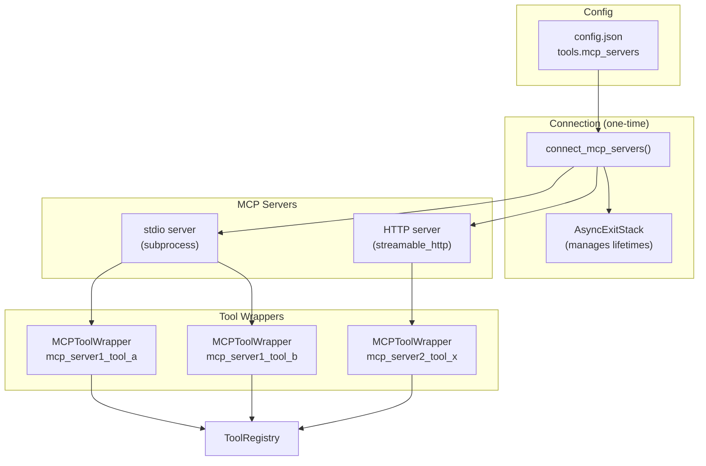
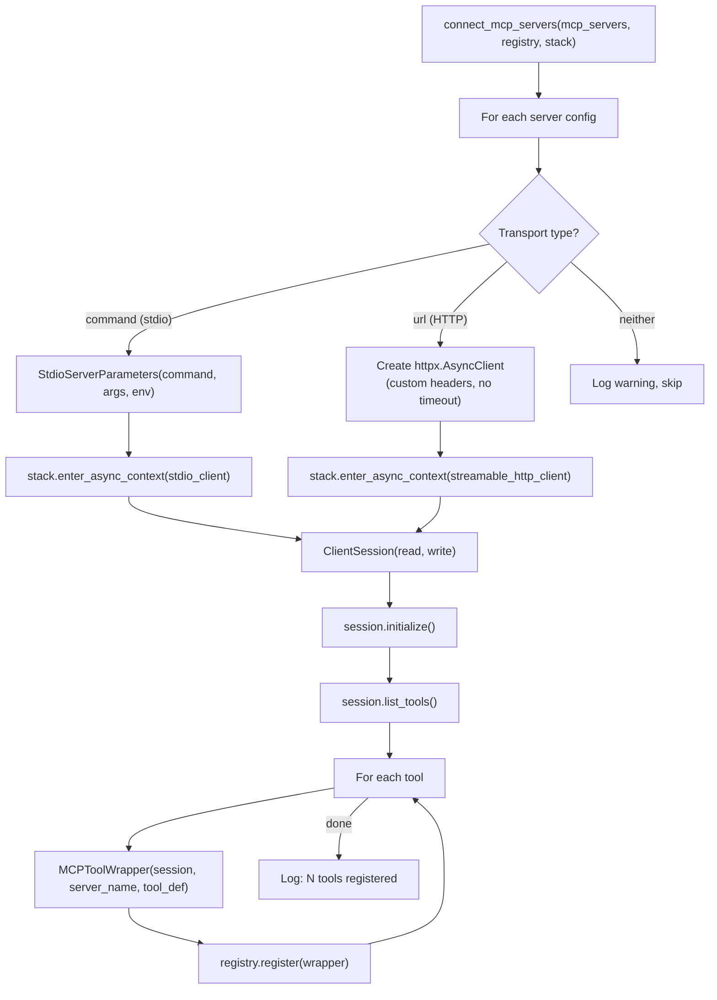
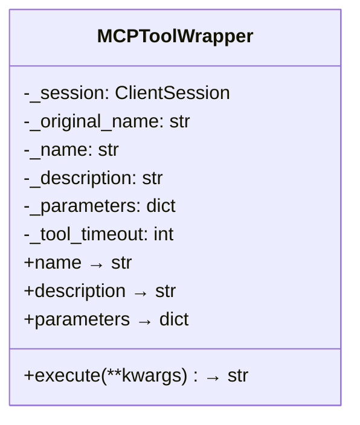
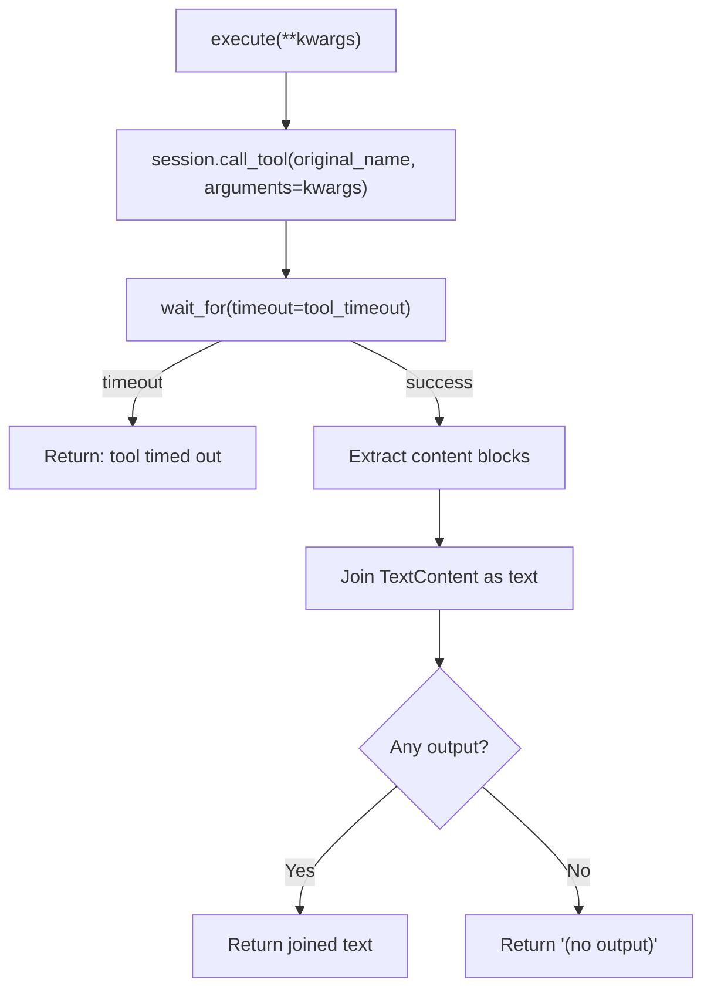
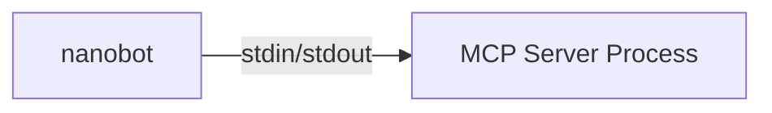
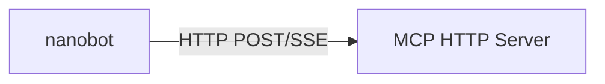
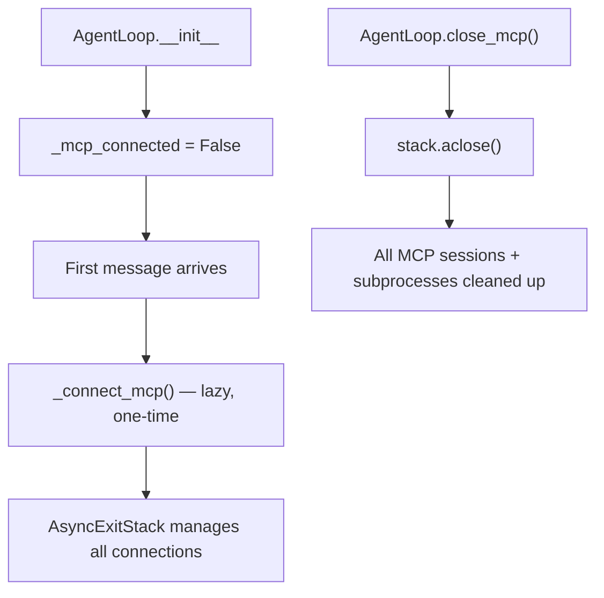

# MCP Integration — Model Context Protocol

**Source:** `nanobot/agent/tools/mcp.py`

## Purpose

Connects to external MCP (Model Context Protocol) servers and wraps their tools as native nanobot tools. This enables the agent to use arbitrary external capabilities (databases, APIs, custom services) without code changes.

## Architecture



## Connection Flow



## MCPToolWrapper



### Naming Convention

MCP tools are namespaced to avoid collisions:

```
mcp_{server_name}_{tool_name}
```

Example: A server named `"github"` with a tool `"create_issue"` becomes `mcp_github_create_issue`.

### Execution



## Transport Types

### stdio (subprocess)



Config:
```json
{
  "my_server": {
    "command": "python",
    "args": ["-m", "my_mcp_server"],
    "env": { "API_KEY": "..." }
  }
}
```

### HTTP (streamable)



Config:
```json
{
  "my_server": {
    "url": "http://localhost:3000/mcp",
    "headers": { "Authorization": "Bearer ..." }
  }
}
```

The HTTP client is configured with:
- Custom headers from config
- `follow_redirects=True`
- `timeout=None` (deferred to per-tool `tool_timeout`)

## Lifecycle Management



The `AsyncExitStack` ensures proper cleanup of all MCP connections, stdio subprocesses, and HTTP clients when the agent shuts down.

## Error Handling

| Error | Behavior |
|-------|----------|
| Server connection failure | Logged, other servers still connect |
| Tool call timeout | Returns timeout message (doesn't crash) |
| Server crash mid-session | Tool calls fail with error (requires restart) |
| No command or URL in config | Warning logged, server skipped |
