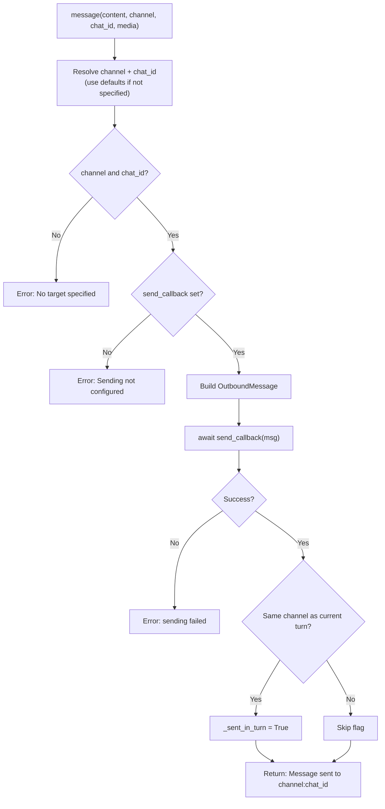
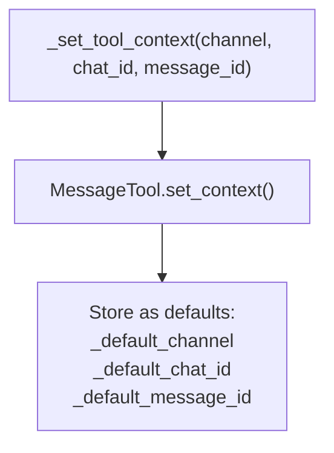
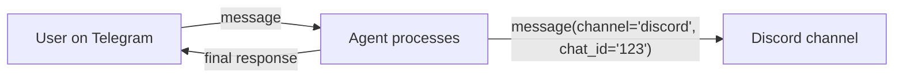

# MessageTool — Channel Message Delivery

**Source:** `nanobot/agent/tools/message.py`

## Purpose

Allows the agent to explicitly send messages to specific chat channels during tool execution. When used, it suppresses the automatic final response delivery to avoid duplicate messages.

## Parameters

| Parameter | Type | Required | Description |
|-----------|------|----------|-------------|
| `content` | string | Yes | Message content to send |
| `channel` | string | No | Target channel (defaults to current) |
| `chat_id` | string | No | Target chat/user ID (defaults to current) |
| `media` | array[string] | No | File paths to attach |

## Execution Flow



## `_sent_in_turn` Flag

This flag controls whether the agent loop suppresses the final outbound message:

```mermaid
sequenceDiagram
    participant Loop as AgentLoop
    participant MT as MessageTool
    participant Bus as MessageBus
    participant LLM

    Loop->>MT: start_turn()
    Note over MT: _sent_in_turn = False

    Loop->>LLM: chat(messages)
    LLM-->>Loop: tool_call: message("Hello!")
    Loop->>MT: execute(content="Hello!")
    MT->>Bus: publish_outbound(msg)
    Note over MT: _sent_in_turn = True

    LLM-->>Loop: final response "I sent the message"

    Loop->>Loop: Check _sent_in_turn
    Note over Loop: True → return None<br/>(skip automatic delivery)
```

Without this flag, the user would receive both the explicit `message()` call and the final response — a duplicate.

## Context Setting



Context is set at the start of each `_process_message()` call, so the tool always knows the current conversation's channel and chat ID.

## Cross-Channel Messaging

The agent can send messages to a different channel than the one it received from:



When sending cross-channel, `_sent_in_turn` is NOT set (since the target differs from the current turn), so the normal response still flows back to the original channel.
