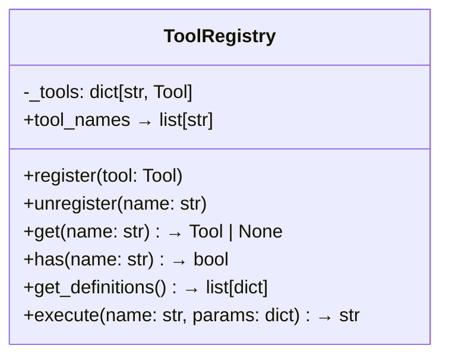
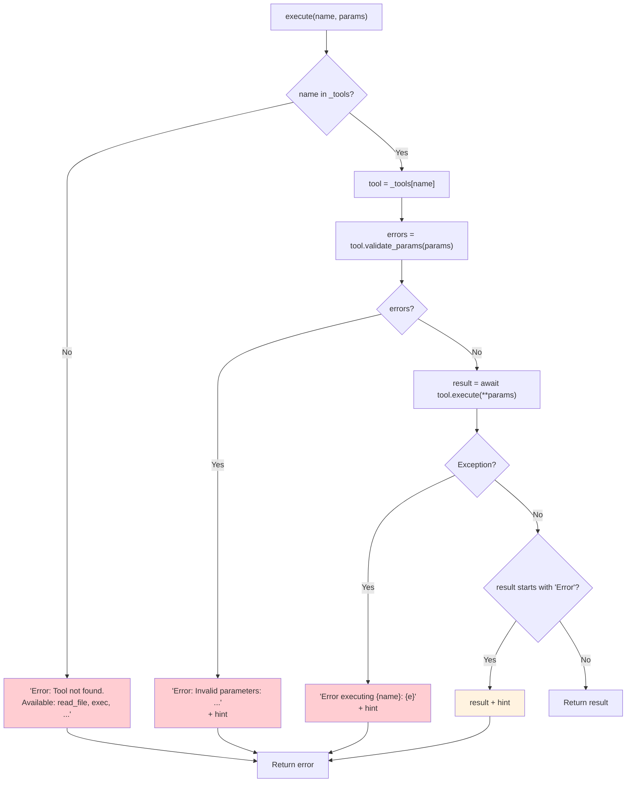

# ToolRegistry — Dynamic Tool Management

**Source:** `nanobot/agent/tools/registry.py`

## Purpose

A simple dictionary-based registry that manages tool discovery, validation, and execution. Serves as the bridge between LLM tool calls and actual tool implementations.

## Class Overview



## Execution Pipeline



The hint `[Analyze the error above and try a different approach.]` is appended to all error paths.

## Schema Generation

`get_definitions()` returns all tools in OpenAI function-calling format:

```json
[
  {
    "type": "function",
    "function": {
      "name": "read_file",
      "description": "Read the contents of a file at the given path.",
      "parameters": {
        "type": "object",
        "properties": { "path": { "type": "string" } },
        "required": ["path"]
      }
    }
  }
]
```

This list is passed to `provider.chat(tools=...)` on every LLM call.
