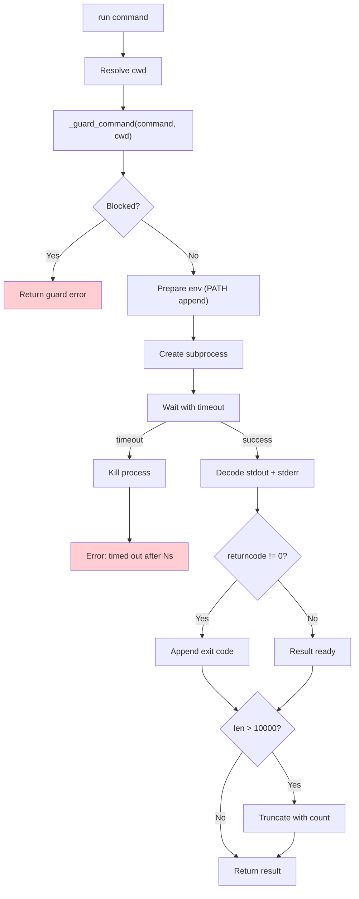
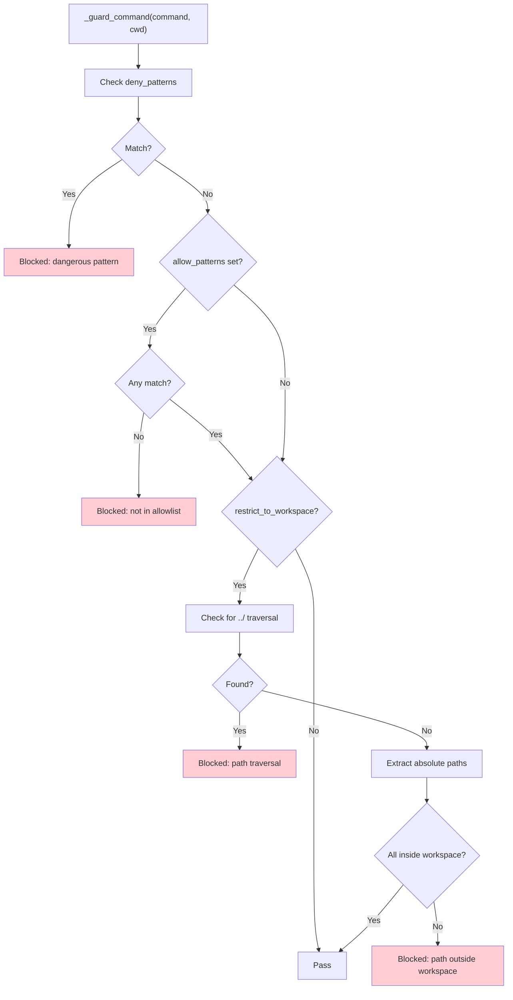
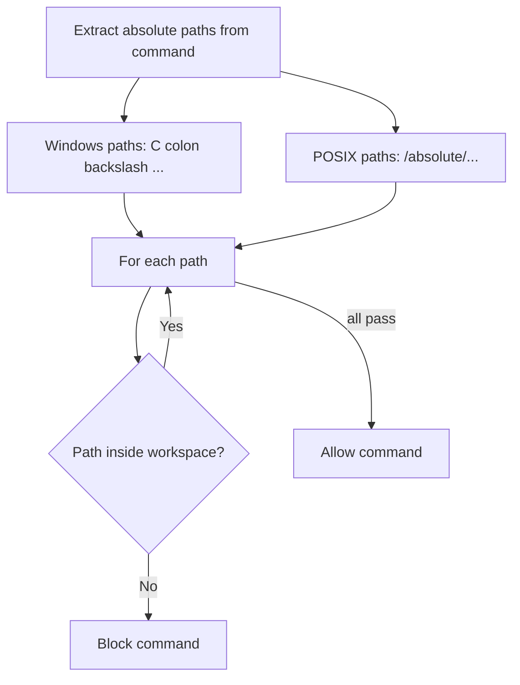

# ExecTool — Shell Command Execution

**Source:** `nanobot/agent/tools/shell.py`

## Purpose

Runs shell commands via `asyncio.create_subprocess_shell` with safety guards, timeout enforcement, and output truncation. The most powerful — and most dangerous — tool in the agent's toolbox.

## Parameters

| Parameter | Type | Required | Description |
|-----------|------|----------|-------------|
| `command` | string | Yes | Shell command to run |
| `working_dir` | string | No | Override working directory |

## Execution Flow

## Safety Guard System

### Default Deny Patterns

| Pattern | Blocks |
|---------|--------|
| `rm -rf`, `rm -r` | Recursive deletion |
| `del /f`, `del /q` | Windows force delete |
| `rmdir /s` | Windows recursive remove |
| `format` (standalone) | Disk format |
| `mkfs`, `diskpart` | Disk operations |
| `dd if=` | Raw disk write |
| `> /dev/sd` | Direct disk write |
| `shutdown`, `reboot`, `poweroff` | System power |
| Fork bomb pattern | Fork bomb |

### Workspace Restriction

When `restrict_to_workspace` is enabled:

## Output Handling

| Output Component | Condition | Format |
|-----------------|-----------|--------|
| stdout | Always (if non-empty) | Raw text |
| stderr | If non-empty | Prefixed with `STDERR:\n` |
| Exit code | If non-zero | `\nExit code: N` |
| Truncation | If > 10,000 chars | `... (truncated, N more chars)` |
| No output | Empty stdout + stderr | `(no output)` |

## Configuration

The tool accepts configuration from `ExecToolConfig`:

| Config | Default | Description |
|--------|---------|-------------|
| `timeout` | 60s | Max run time before kill |
| `path_append` | `""` | Additional PATH entries |
| `restrict_to_workspace` | `false` | Sandbox to workspace directory |
