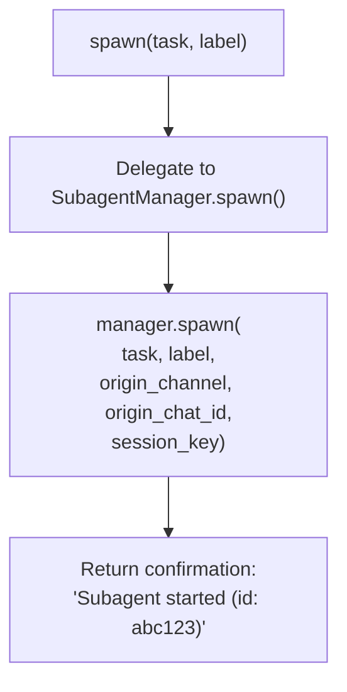
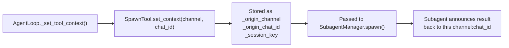
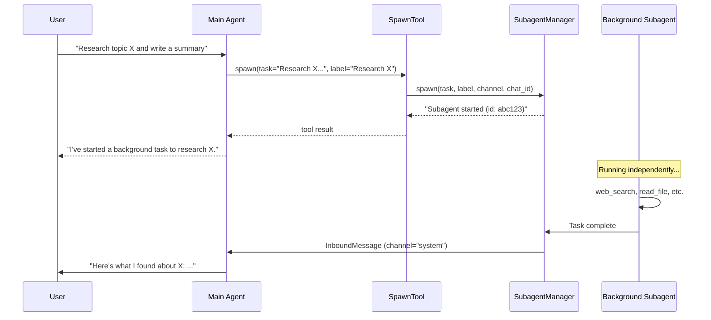

# SpawnTool — Background Subagent Creation

**Source:** `nanobot/agent/tools/spawn.py`

## Purpose

A thin adapter between the LLM's tool-calling interface and the `SubagentManager`. Allows the agent to delegate tasks to background subagents.

## Parameters

| Parameter | Type | Required | Description |
|-----------|------|----------|-------------|
| `task` | string | Yes | Task description for the subagent |
| `label` | string | No | Short display label |

## Execution Flow

## Context Propagation

The origin context ensures subagent results are routed back to the correct conversation.

## Interaction Pattern

