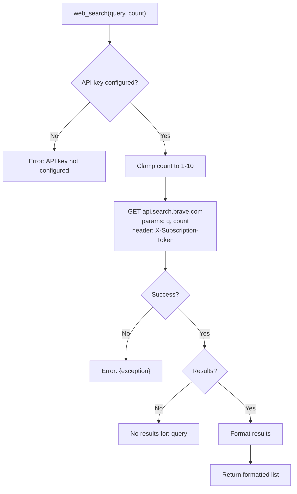
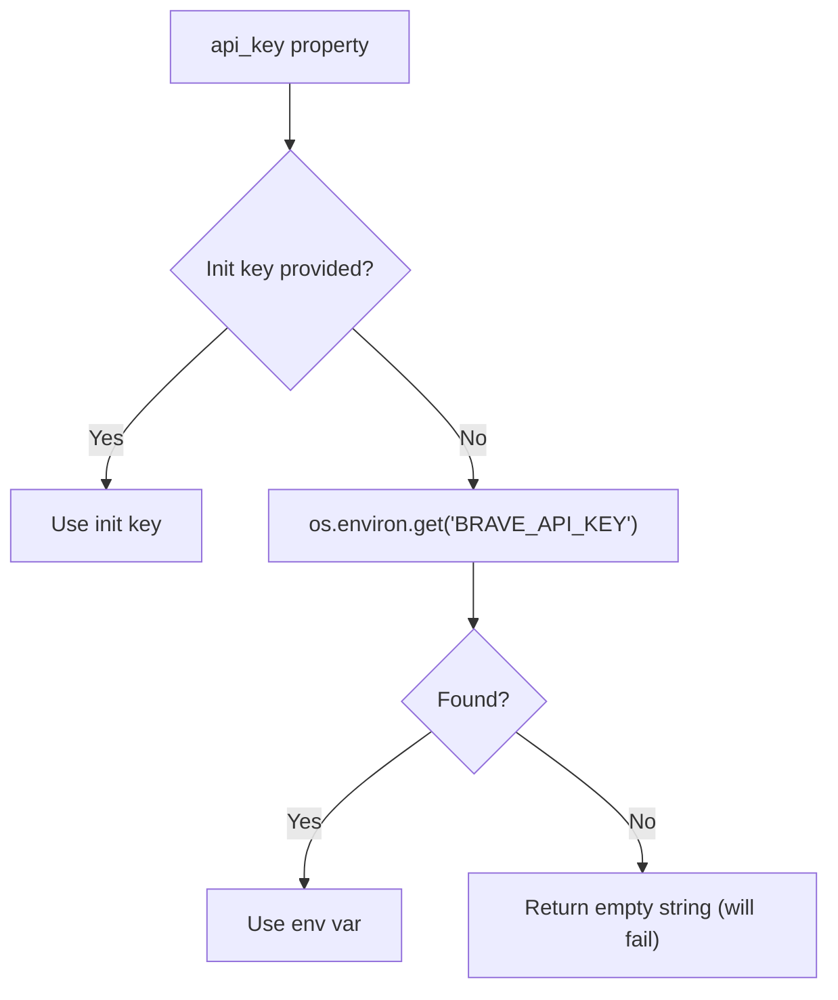
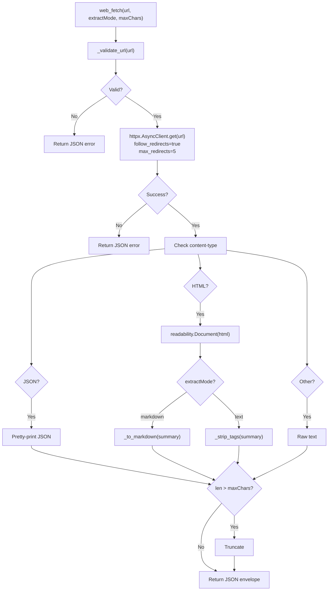
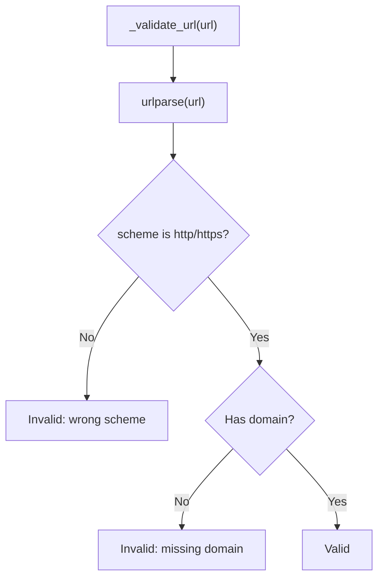
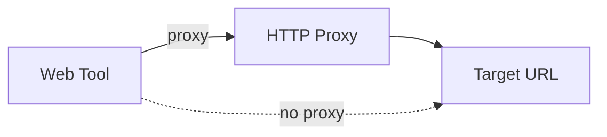

# Web Tools — WebSearch and WebFetch

**Source:** `nanobot/agent/tools/web.py`

## Purpose

Two tools for web interaction:
- **`web_search`**: Search the web via Brave Search API
- **`web_fetch`**: Fetch and extract readable content from URLs

Both support optional HTTP proxy configuration.

---

## WebSearchTool

### Parameters

| Parameter | Type | Required | Description |
|-----------|------|----------|-------------|
| `query` | string | Yes | Search query |
| `count` | integer | No | Number of results (1-10, default 5) |

### Execution Flow



### Output Format

```
Results for: nanobot ai assistant

1. Title One
   https://example.com/one
   Description snippet...
2. Title Two
   https://example.com/two
   Description snippet...
```

### API Key Resolution



The key is resolved at call-time (not init-time), so env var changes take effect without restart.

---

## WebFetchTool

### Parameters

| Parameter | Type | Required | Description |
|-----------|------|----------|-------------|
| `url` | string | Yes | URL to fetch |
| `extractMode` | string | No | `"markdown"` (default) or `"text"` |
| `maxChars` | integer | No | Max characters (default 50,000) |

### Execution Flow



### URL Validation



### HTML-to-Markdown Conversion

The `_to_markdown()` method performs lightweight HTML → markdown conversion:

| HTML | Markdown |
|------|----------|
| `<a href="url">text</a>` | `[text](url)` |
| `<h1>text</h1>` | `# text` |
| `<li>text</li>` | `- text` |
| `</p>`, `</div>` | `\n\n` |
| `<br>`, `<hr>` | `\n` |
| All other tags | Stripped |

### Return Format

Both success and error return JSON:

```json
{
  "url": "https://example.com",
  "finalUrl": "https://example.com/redirected",
  "status": 200,
  "extractor": "readability",
  "truncated": false,
  "length": 4523,
  "text": "# Page Title\n\nExtracted content..."
}
```

---

## Shared Utilities

| Function | Purpose |
|----------|---------|
| `_strip_tags(text)` | Remove HTML tags, scripts, styles; decode entities |
| `_normalize(text)` | Collapse whitespace, limit blank lines to 2 |
| `_validate_url(url)` | Validate URL scheme and domain |

## Proxy Support

Both tools accept an optional `proxy` parameter (e.g., `http://proxy:8080`). When set:



Proxy errors are caught and reported distinctly from other errors.
