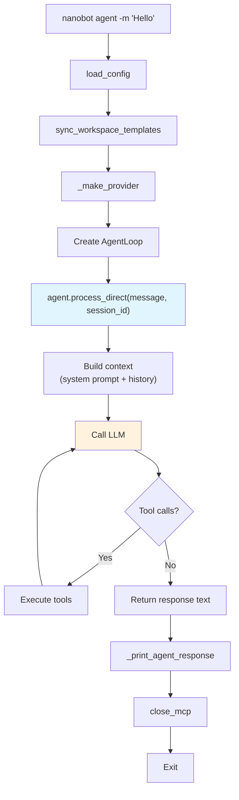
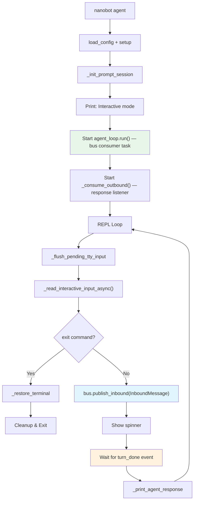
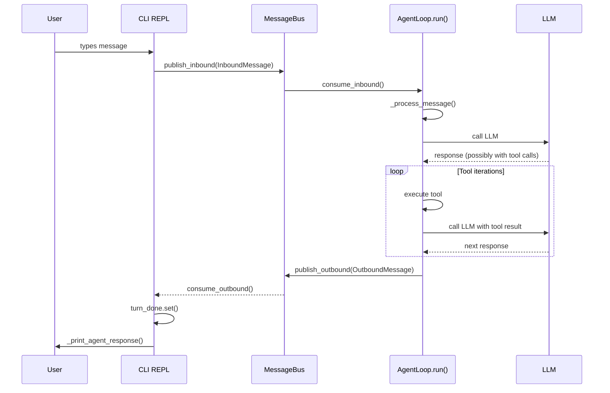
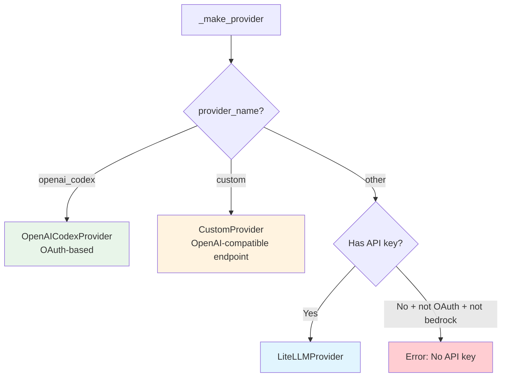

# `nanobot agent` — Chat Command

**Source:** `nanobot/cli/commands.py:419-587`

## Purpose

The primary user-facing command. Operates in two modes:
- **Single-shot** (`-m "message"`): send one message, print the response, exit.
- **Interactive** (no `-m`): REPL-style chat session with history navigation and paste support.

## Options

| Flag | Default | Description |
|------|---------|-------------|
| `-m`, `--message` | `None` | Message text (single-shot mode if provided) |
| `-s`, `--session` | `cli:direct` | Session key (`channel:chat_id`) |
| `--markdown/--no-markdown` | `True` | Render response as Rich Markdown |
| `--logs/--no-logs` | `False` | Show internal loguru logs |

---

## Single-Shot Mode

### Key Behavior

- `process_direct()` bypasses the MessageBus entirely — direct function call → LLM → response string.
- A spinner (`nanobot is thinking...`) displays while waiting (unless `--logs` is on).
- The agent may loop up to `max_iterations` (default 40) tool-call rounds before returning.

---

## Interactive Mode

### Message Flow (Interactive)

### Interactive Mode Details

- **Input handling:** `prompt_toolkit` provides line editing, up/down history navigation, and bracketed paste mode.
- **History persistence:** Saved to `~/.nanobot/history/cli_history`.
- **Exit commands:** `exit`, `quit`, `/exit`, `/quit`, `:q`, `Ctrl+C`, `EOF`.
- **Progress updates:** Outbound messages with `_progress` metadata are rendered inline as dim `↳ ...` hints (subject to `send_progress`/`send_tool_hints` channel config).
- **Terminal safety:** Original termios attributes are saved on init and restored on every exit path (including SIGINT).

---

## Provider Selection (`_make_provider`)

Three provider types are supported:
1. **OpenAI Codex** — OAuth token-based, via `oauth_cli_kit`.
2. **Custom** — Direct OpenAI-compatible API (bypasses LiteLLM routing).
3. **LiteLLM** — All other providers, routed through LiteLLM's unified interface.
