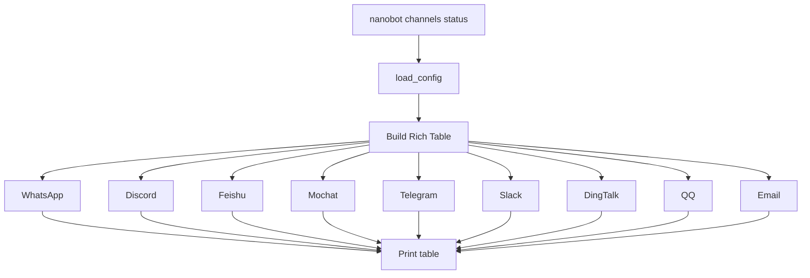
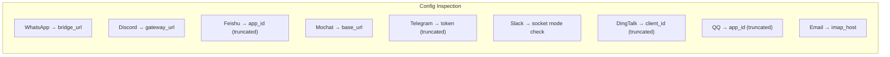
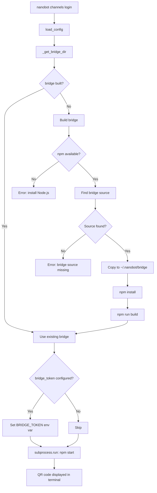
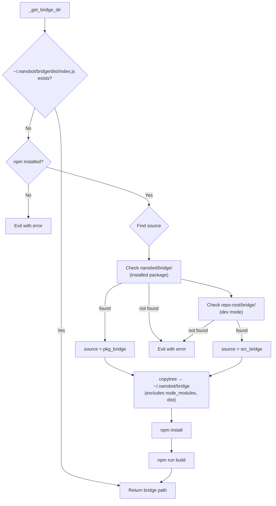

# `nanobot channels` — Channel Management

**Source:** `nanobot/cli/commands.py:595-773`

## Subcommands

| Command | Description |
|---------|-------------|
| `nanobot channels status` | Display configuration status of all channels |
| `nanobot channels login` | Start WhatsApp bridge for QR-code device linking |

---

## `channels status`

**Source:** Lines 599-689

### Flow Diagram

Each channel row shows:

| Column | Content |
|--------|---------|
| Channel | Platform name |
| Enabled | `✓` / `✗` |
| Configuration | Key config value (URL, token prefix, app_id prefix, etc.) |

### Channel Config Details

---

## `channels login`

**Source:** Lines 750-773

### Purpose

Links a WhatsApp device by starting the bridge process and displaying a QR code for scanning.

### Flow Diagram

### Bridge Setup (`_get_bridge_dir`)

