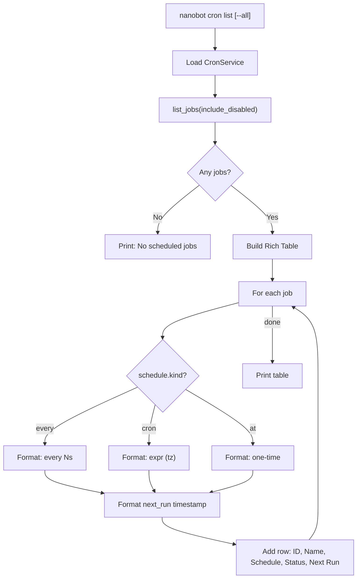
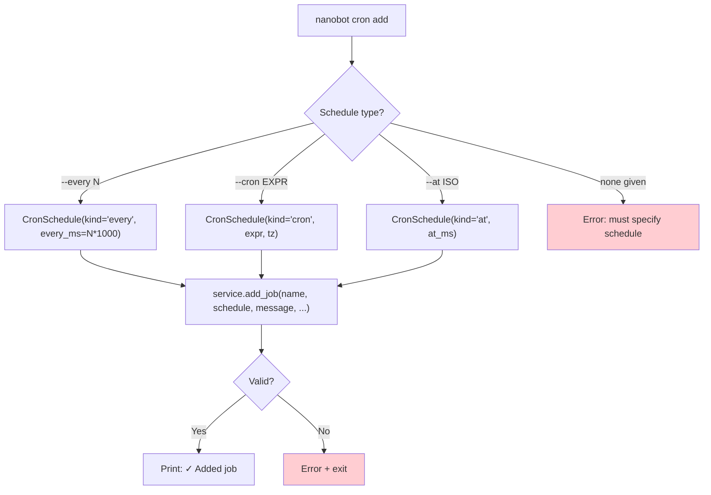
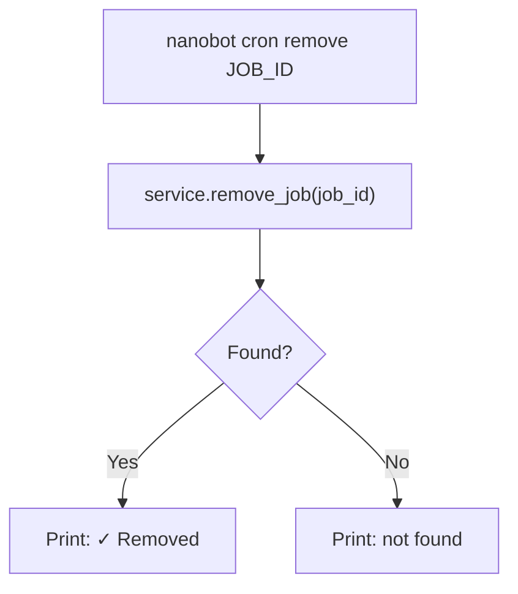
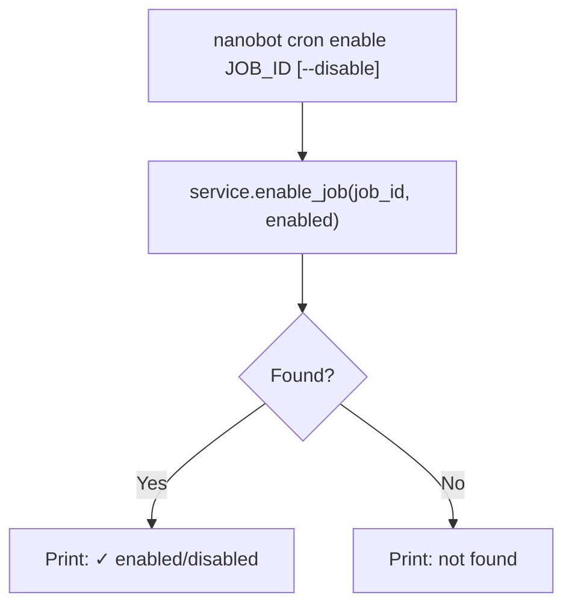
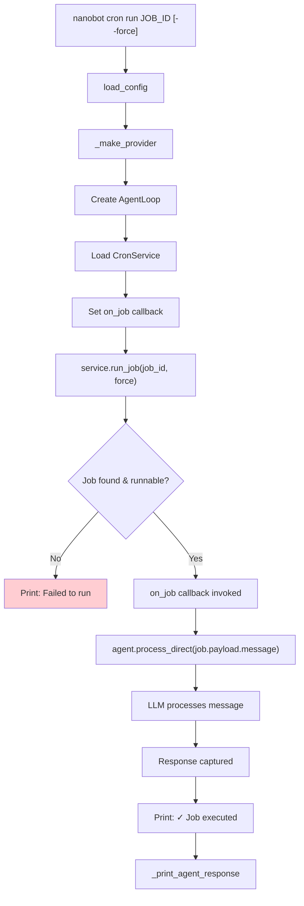
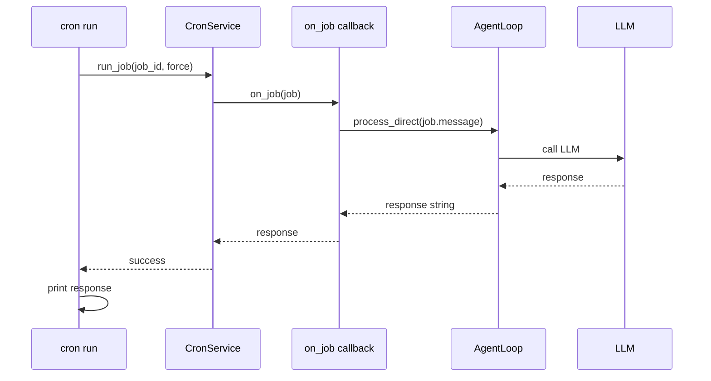

# `nanobot cron` — Scheduled Task Management

**Source:** `nanobot/cli/commands.py:779-987`

## Subcommands

| Command | Description |
|---------|-------------|
| `nanobot cron list` | List scheduled jobs |
| `nanobot cron add` | Create a new job |
| `nanobot cron remove` | Delete a job |
| `nanobot cron enable` | Enable or disable a job |
| `nanobot cron run` | Manually trigger a job |

All commands operate on the persistent store at `~/.nanobot/cron/jobs.json`.

---

## `cron list`

**Source:** Lines 783-833

---

## `cron add`

**Source:** Lines 836-886

### Options

| Flag | Description |
|------|-------------|
| `-n`, `--name` | Job name (required) |
| `-m`, `--message` | Agent instruction (required) |
| `-e`, `--every` | Interval in seconds |
| `-c`, `--cron` | Cron expression |
| `--tz` | IANA timezone (cron only) |
| `--at` | ISO timestamp for one-time execution |
| `-d`, `--deliver` | Deliver response to a channel |
| `--to` | Recipient identifier |
| `--channel` | Target channel name |

### Flow Diagram

### Validation

- `--tz` is only valid with `--cron` (rejected otherwise).
- Exactly one of `--every`, `--cron`, or `--at` must be provided.

---

## `cron remove`

**Source:** Lines 889-903

---

## `cron enable`

**Source:** Lines 906-923

---

## `cron run`

**Source:** Lines 926-987

### Purpose

Manually triggers a job by spinning up a temporary `AgentLoop`, executing the job's message through `process_direct()`, and displaying the response.

### Flow Diagram

### Sequence Diagram

### Notes

- `--force` allows running disabled jobs.
- Unlike `gateway` mode, no bus or channels are involved — purely a direct agent call.
- The temporary `AgentLoop` is created without `cron_service` injected (the tool won't be available), since we're just executing one job's payload.
