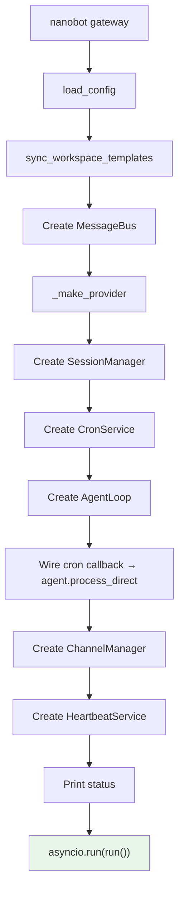
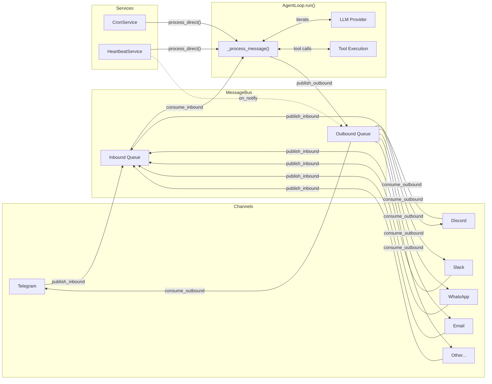
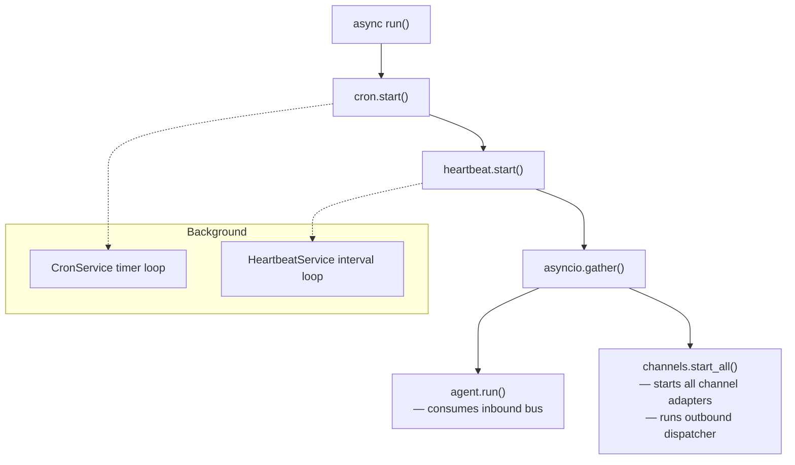
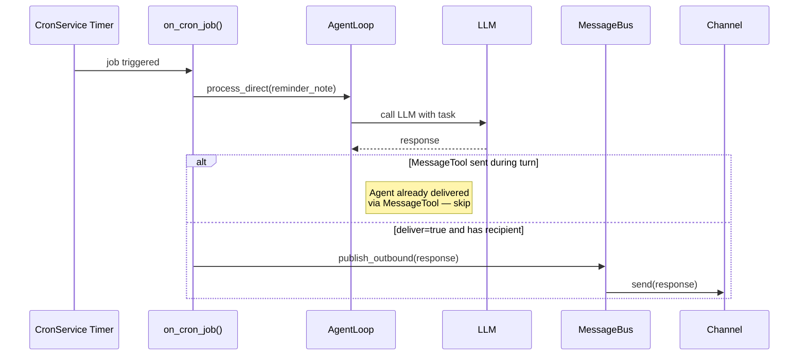
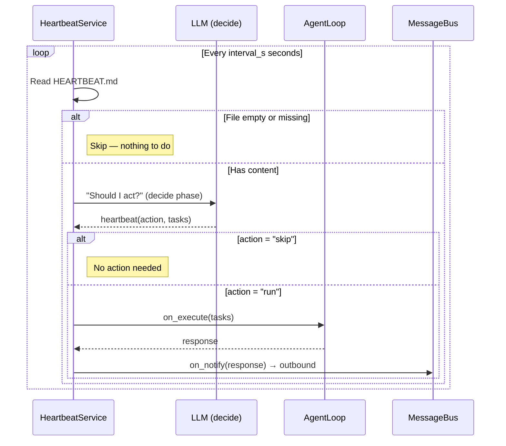
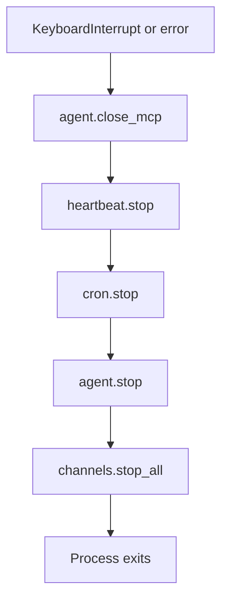

# `nanobot gateway` — Multi-Channel Server

**Source:** `nanobot/cli/commands.py:244-409`

## Purpose

The long-running server mode. Starts the agent loop, all enabled channels, cron scheduler, and heartbeat service. This is the production deployment command.

## Options

| Flag | Default | Description |
|------|---------|-------------|
| `-p`, `--port` | `18790` | Gateway port |
| `-v`, `--verbose` | `False` | Enable debug logging |

---

## Startup Sequence

## Runtime Architecture

## Concurrent Tasks (`run()`)

## Cron Job Execution Flow

## Heartbeat Execution Flow

## Shutdown Sequence

## Heartbeat Target Selection

`_pick_heartbeat_target()` determines where heartbeat responses are delivered:

1. Scans `SessionManager.list_sessions()` (most recently updated first).
2. Picks the first session on an enabled, non-internal channel (`cli` and `system` are excluded).
3. Falls back to `("cli", "direct")` if no external channel session exists.
