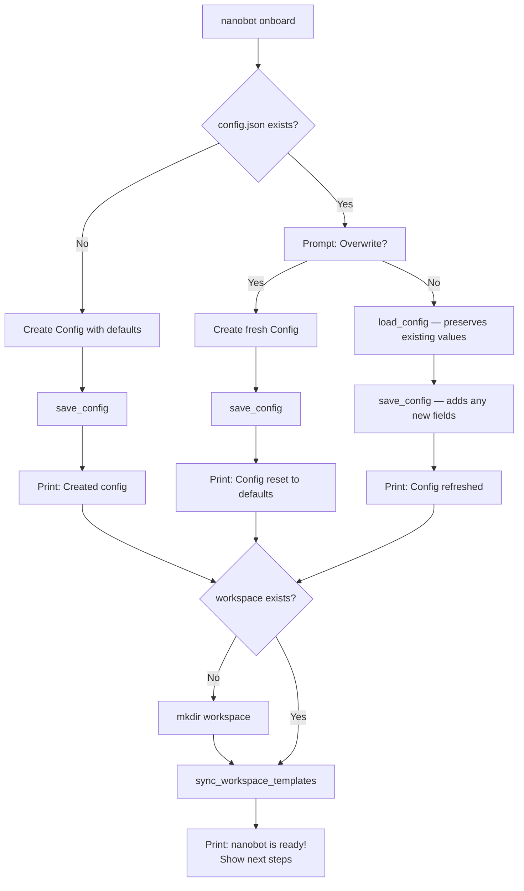

# `nanobot onboard` — Setup Command

**Source:** `nanobot/cli/commands.py:156-195`

## Purpose

First-time initialization of nanobot's configuration file and workspace directory. Also used to refresh an existing config (adding new fields while preserving existing values).

## Flow Diagram

## Key Details

### Config Refresh (non-destructive path)

When the user declines overwrite, `load_config()` deserializes existing JSON into the Pydantic `Config` model, which fills in defaults for any new fields. `save_config()` then serializes the full model back — effectively patching the file with new schema additions.

### `sync_workspace_templates()`

Copies bundled template files (`SOUL.md`, `AGENTS.md`, `TOOLS.md`, `IDENTITY.md`, `USER.md`, `memory/MEMORY.md`, etc.) into the workspace. **Never overwrites** existing files — only creates missing ones.

### Produced Artifacts

| Artifact | Path |
|----------|------|
| Config file | `~/.nanobot/config.json` |
| Workspace | `~/.nanobot/workspace/` (default) |
| Identity files | `workspace/{SOUL,AGENTS,TOOLS,IDENTITY,USER}.md` |
| Memory files | `workspace/memory/{MEMORY,HISTORY}.md` |
| Skills directory | `workspace/skills/` |
