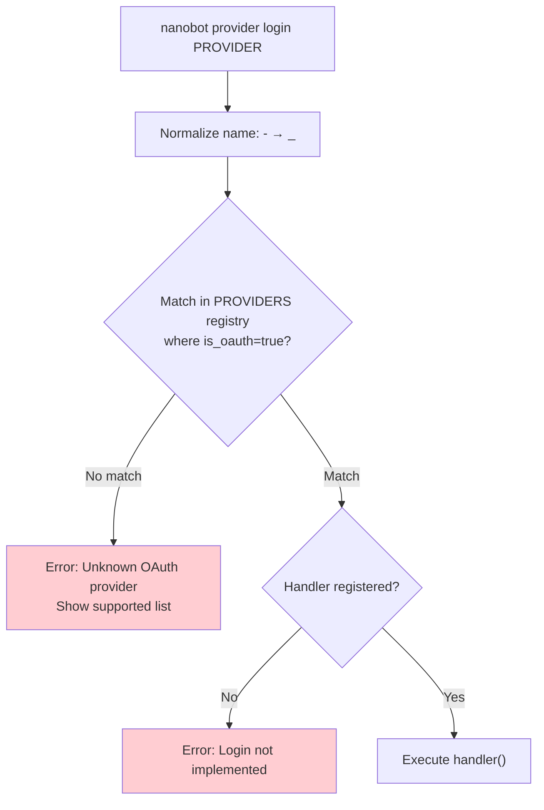
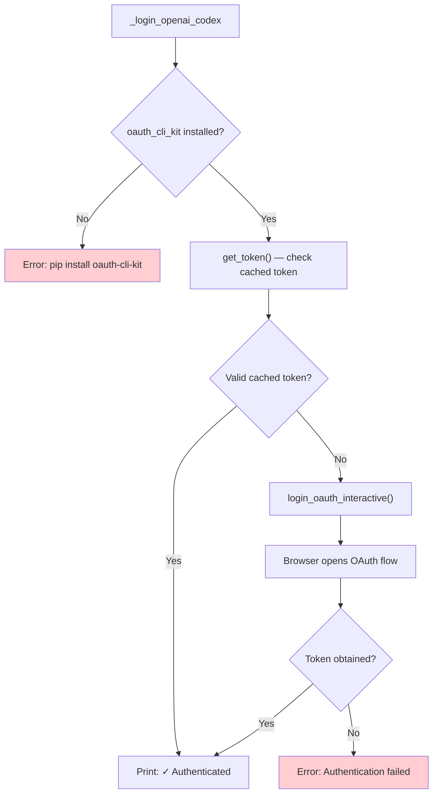
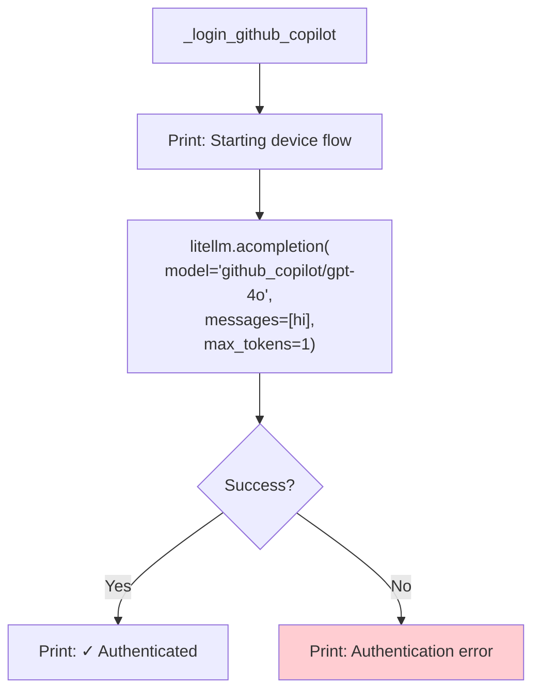
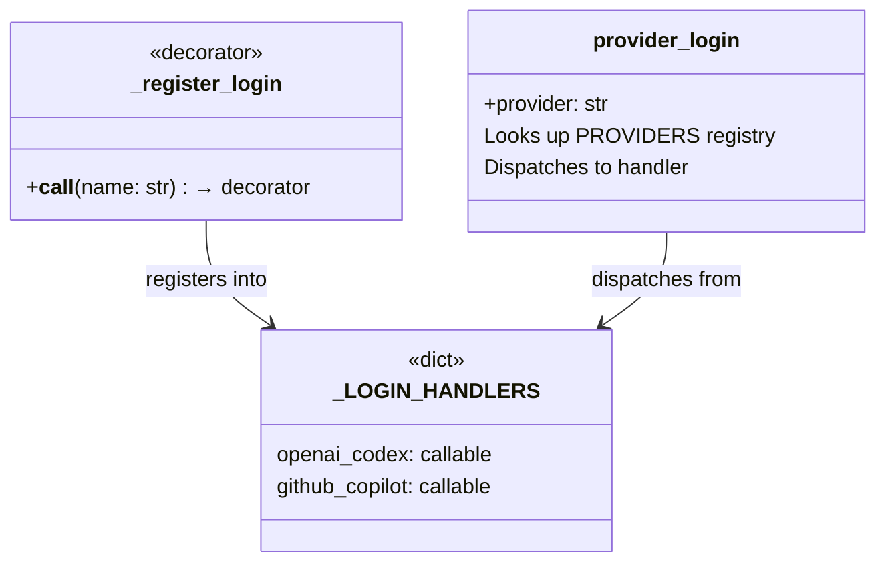

# `nanobot provider` — Provider Authentication

**Source:** `nanobot/cli/commands.py:1036-1112`

## Subcommands

| Command | Description |
|---------|-------------|
| `nanobot provider login <provider>` | Authenticate with an OAuth provider |

Currently supported OAuth providers:
- `openai-codex` — OpenAI Codex (via `oauth_cli_kit`)
- `github-copilot` — GitHub Copilot (device flow via LiteLLM)

---

## Login Dispatch

The handler registry pattern (`_LOGIN_HANDLERS` + `@_register_login`) decouples provider discovery from login implementation.

---

## OpenAI Codex Login

**Source:** Lines 1073-1094

### Details

1. First attempts to retrieve a cached token via `get_token()`.
2. If no valid token exists, launches an interactive OAuth flow (opens browser).
3. On success, prints the account ID. The token is cached by `oauth_cli_kit` for future use.

---

## GitHub Copilot Login

**Source:** Lines 1097-1112

### Details

This leverages LiteLLM's built-in GitHub Copilot device flow:
1. Calling `acompletion` with a `github_copilot/` model triggers LiteLLM's device code flow.
2. The user is prompted to visit `https://github.com/login/device` and enter a code.
3. Once approved, LiteLLM caches the Copilot token for subsequent requests.
4. The actual API response is discarded — only the auth side-effect matters.

---

## Registration Pattern

To add a new OAuth provider:
1. Add a `ProviderSpec(is_oauth=True)` to the `PROVIDERS` registry.
2. Decorate a function with `@_register_login("provider_name")`.
