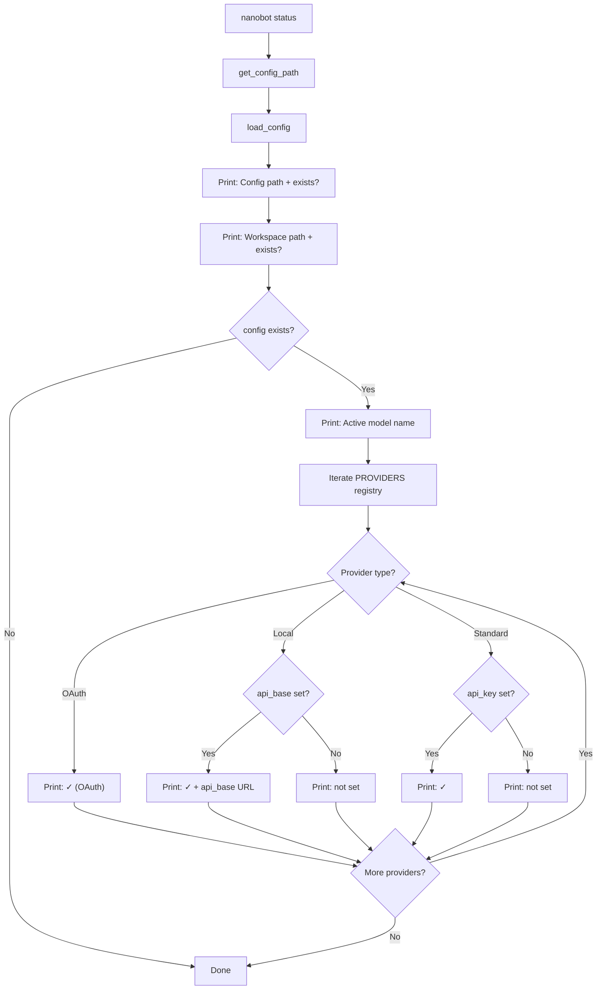
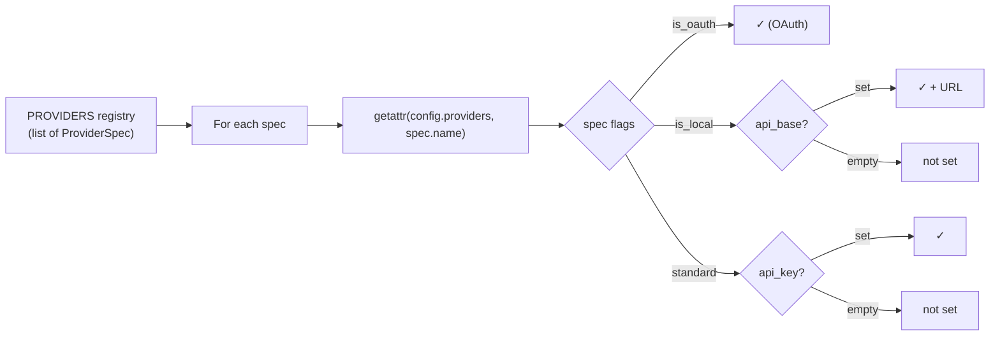

# `nanobot status` — System Status

**Source:** `nanobot/cli/commands.py:995-1029`

## Purpose

Displays configuration and connectivity status at a glance: config file presence, workspace existence, active model, and API key status for all registered providers.

## Flow Diagram



## Example Output

```
🤖 nanobot Status

Config: ~/.nanobot/config.json ✓
Workspace: ~/.nanobot/workspace ✓
Model: openrouter/anthropic/claude-sonnet-4
OpenRouter: ✓
OpenAI: not set
Anthropic: not set
Google Gemini: not set
OpenAI Codex: ✓ (OAuth)
Ollama: not set
```

## Provider Status Logic

The status check uses the `PROVIDERS` registry as the single source of truth:



No network calls are made — this is purely a config inspection command.
